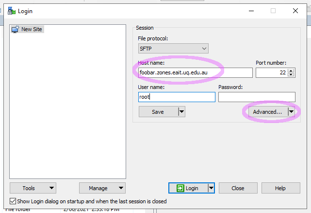
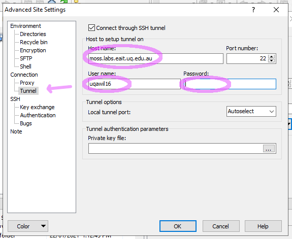
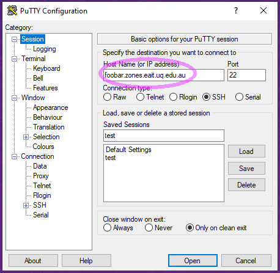
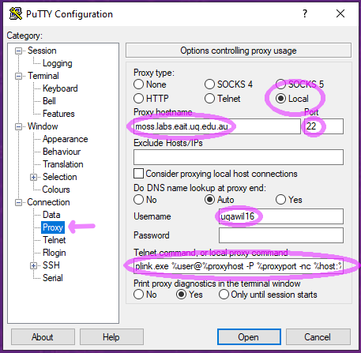
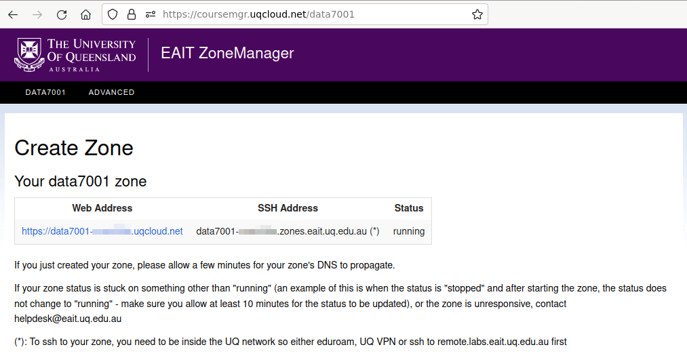
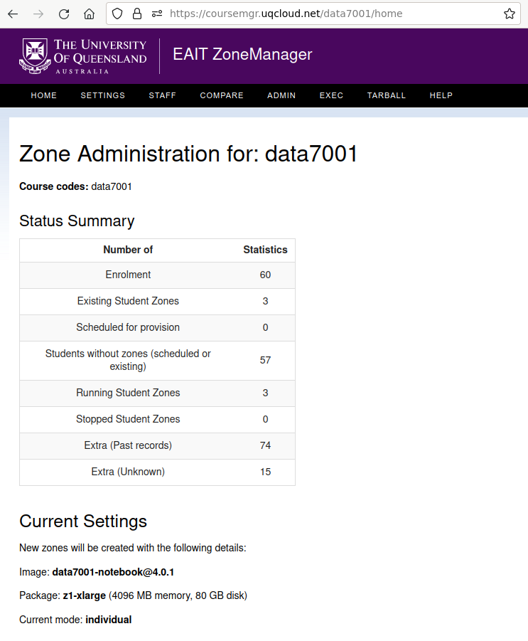

:toc: left
:source-highlighter: pygments
:doctype: book
:numbered:
:idprefix:
:docinfo:
:data-uri:
:icons: font

:uri-sshkeys: https://internal.eait.uq.edu.au/accounts/sshkeys.ephp
:uri-studentkeys: https://student.eait.uq.edu.au/accounts/sshkeys.ephp
:uri-winscp: https://winscp.net/eng/download.php
:uri-filezilla: https://filezilla-project.org/download.php?platform=win64
:uri-cyberduck: https://cyberduck.io/download/
:uri-uqvpn: https://my.uq.edu.au/information-and-services/information-technology/working-remotely/vpn-virtual-private-network
:uri-eaitvpn: https://help.eait.uq.edu.au/remote/vpn/
:uri-winscp-tunnel: https://winscp.net/eng/docs/ui_login_tunnel
:uri-cyberduck-tunnel: https://trac.cyberduck.io/wiki/help/en/howto/sftp#ConnectviaSSHtunnelthroughbastionserver
:uri-nginx-map: http://nginx.org/en/docs/http/ngx_http_map_module.html
:uri-laravel: https://laravel.com
:uri-pdo: https://www.php.net/manual/en/book.pdo.php
:uri-drupal: https://www.drupal.org/
:uri-drupal-nginx: https://www.nginx.com/resources/wiki/start/topics/recipes/drupal/
:uri-man-chmod: https://illumos.org/man/1/chmod
:uri-django: https://www.djangoproject.com/
:uri-flask: https://github.com/pallets/flask
:uri-flask-docs: https://flask.palletsprojects.com/en/1.1.x/
:uri-express: https://expressjs.com
:uri-mongo-js: https://mongodb.github.io/node-mongodb-native/3.5/
:uri-node-http: https://nodejs.org/docs/latest-v11.x/api/http.html
:uri-yaml: https://yaml.org/
:uri-django-remote: https://docs.djangoproject.com/en/3.1/howto/auth-remote-user/
:uri-django-rub: https://docs.djangoproject.com/en/3.1/ref/contrib/auth/#django.contrib.auth.backends.RemoteUserBackend
:uri-ghost: https://hub.docker.com/_/ghost
:uri-chat: https://chat.uq.edu.au/_matrix/client/#/room/#uqcloud:chat.uq.edu.au
:uri-yaml: https://yaml.org/
:uri-aperture-conds: https://github.com/TritonDataCenter/node-aperture#conditions
:uri-manta-actions: https://github.com/TritonDataCenter/manta-muskie/blob/master/docs/internal/acuserguide.md#actions
:uri-cloudapi: https://github.com/TritonDataCenter/sdc-cloudapi/blob/master/docs/index.md#account
:uri-jupyter: https://jupyter.org/

= UQcloud zones guide
:author: Alex Wilson (EAIT ITIG)
:email: helpdesk@eait.uq.edu.au

== Introduction

This guide is intended to give both a general overview of and specific advice on
using zones on `uqcloud.net`.

For most of this guide to make sense, you will need some basic familiarity with
a UNIX/Linux commandline environment and tools such as SSH or SFTP.

More advanced topics will likely require some familiarity with computer
networking topics (such as TCP/IP) and web application and database design.

=== What is a zone? Why would I want one?

Zones are a specific kind of virtualisation technology. Virtualisation is the
process of making one computer "pretend" to be multiple (usually smaller)
computers -- in the case of UQcloud, we do this in order to allow large servers
to be broken up into small units for hosting websites and applications which
do not need all of the available capacity on a large server.

A zone functions as though it was a small computer controlled completely by
you (you get "root" access), which you can use to run programs or store data.
It has a permanent network connection, protected power circuits with battery
and generator backup, and redundancy to guard against disk failure and other
problems.

It is very similar in concept to a Virtual Private Server (VPS), cloud instance,
or Virtual Machine (VM) hosted by a commercial hosting provider like Amazon AWS.

Some typical uses of zones include:

 * Hosting websites that don't fit within the official UQ Drupal environment
   (e.g. for a coursework project, a conference, or even a student society);
 * Running a web application with a database (e.g. a specialised marking tool
   or an interactive system for teaching); or
 * Developing and testing new programs or applications.

The reason why we provide zones rather than true Virtual Machines for UQcloud
is about cost -- the zones technology allows us to deploy many more applications
per physical server than most other options on the market, which in turn allows
us to offer them for use in situations where it would not make sense for the
University to pay for commercial hosting.

For example, we automatically allow all UQ students and staff to deploy one
zone for any purpose associated with their job or course of study at the
university. We also can support the use of zones for teaching, where one zone
is created for every student in a course.

Another key advantage of a zone is its position within the UQ network, which
allows it to make easy use of facilities like UQ authentication or the
ability to communicate with other internal devices and systems inside the
University.

== Logging in and installing tools

Before we can create and manage zones, you will need to be logged into your
account on the system and have the tools installed. This section outlines how
to achieve this, as well as some basic guidance on navigating the tools
themselves.

Rather than usernames and passwords, the system which manages zones (named
"Triton") uses SSH key pairs for authentication.

An SSH key pair consists of two parts: a "public" key and a "private" key. The
private key should be kept secret at all times and never shared (even with IT
support or helpdesk) -- the Triton system does not need to know what it is.
The public key, on the other hand, is safe to share, and is what you will need
to give to the Triton system to let it identify you.

=== Managing your SSH keys

It's best for your security to store SSH private keys in one of two ways: either
on disk, encrypted, protected with a strong passphrase; or on a hardware device
like a YubiKey.

On the staff and student general-purpose UNIX servers (`mango.eait.uq.edu.au`
and `moss.labs.eait.uq.edu.au`), there's a command which will help you to
use the first of those two recommended approaches, named `sdc-setup`.

After logging into `mango` or `moss` with your UQ username and password, you
can run `sdc-setup` like this:

[source,shell-session]
....
uqfoobar@mango:~$ sdc-setup
error: no SSH private key found in /home/users/uqfoobar/.ssh/id_rsa

please check that /home/users/uqfoobar/.ssh/id_rsa exists and add the contents
of /home/users/uqfoobar/.ssh/id_rsa.pub to your account at
https://internal.eait.uq.edu.au/accounts/sshkeys.ephp

if this is your first time using SDC, you should generate a key
would you like to generate a new key now? [yN] y <1>

Enter passphrase (empty for no passphrase): <2>
Enter same passphrase again: <3>

Your identification has been saved in /home/users/uqfoobar/.ssh/id_rsa.
Your public key has been saved in /home/users/uqfoobar/.ssh/id_rsa.pub.
The key fingerprint is:
SHA256:hynWoXs2zUG+ZCaAcncV7gM2Ejnf/EddKv7kG/cvEJY uqfoobar@mango.eait.uq.edu.au
The key's randomart image is:
+---[RSA 2048]----+
|      ..  o.     |
|     .o. o      .|
|  . o +o*oo  . o.|
|   o . B.Xo E o .|
|      + S X+ +   |
|     . o O ++ o  |
|      . + +  *. .|
|       o .    +o.|
|              .o+|
+----[SHA256]-----+

now visit this website:
https://internal.eait.uq.edu.au/accounts/sshkeys.ephp <4>
and add the following text as a new key:

ssh-rsa AAAAB3NzaC1yc2EAAAADAQABAAABAQC... <5>

then run sdc-setup again
....
<1> Press `y`.
<2> Make sure to enter a passphrase that is strong and as long as you think
    you can comfortably remember.
<3> Enter the passphrase again.
<4> If you're a staff member, visit {uri-sshkeys}[this URL] in your web browser
    and log in using your UQ username and password. Use
    {uri-studentkeys}[this URL] instead if you're a student (
    `moss.labs.eait.uq.edu.au` will produce different output here).
<5> Then paste the line beginning with `ssh-rsa` into the "Add new key" dialog.

If you already have an SSH key pair which you use for other systems, it's fine
to re-use it for Triton. Just visit the {uri-sshkeys}[SSH key management tool]
(same URL as above) in order to add your key.

It's worth noting that in the SSH key management tool, after you have entered a
key, you have to press the "Save changes" button. This sometimes trips people
up.

TIP: If you're a student or only have an EAIT labs account (e.g. because you're
a course tutor), you might receive a *403 Forbidden* error visiting the regular
(staff) SSH key management tool. You can use the {uri-studentkeys}[matching
page under `student.eait.uq.edu.au`] instead. If both tools return errors,
contact mailto:helpdesk@eait.uq.edu.au[Helpdesk].

You can also return to the SSH key management tool at any time to remove keys
or replace them with new ones (if, for example, you forget or lose one of
your old keys).

If you decide to generate your own keys, we strongly recommend that when using
the `ssh-keygen` command, you should supply the `-o` option. This tells
`ssh-keygen` to use a newer, stronger form of encryption which helps protect
your keys.

If you are interested in the second recommended option -- storing your SSH keys
on a dedicated device like a Yubikey -- we recommend looking at
https://github.com/arekinath/pivy[`pivy`], which works best on MacOS or Linux.

=== Using "triton" on `mango` or `moss`

On both `mango.eait.uq.edu.au` and `moss.labs.eait.uq.edu.au` you will find
the `triton` command and other tools for working with zones pre-installed
and ready to use.

Once you have run `sdc-setup` and created your account you shouldn't need
to re-run it each time you log in -- the key will be automatically found and
set up for you at login.

You can check that your account is working correctly with Triton by running
the command `triton account get`:

[source,shell-session]
....
uqfoobar@mango:~$ triton account get
id: 783fcb12-cfb4-489e-ab1c-fb999661f7c5
login: uqfoobar
email: foo.bar@uq.edu.au
companyName: EAIT
firstName: Foo
lastName: Bar
triton_cns_enabled: true
phone: 12345
updated: 2019-09-25T03:11:34.682Z (18w)
created: 2015-02-02T06:48:25.648Z (4y)
....

If you see an error like this instead:

....
triton account: error (Config): could not load "env" profile (missing TRITON_*, or SDC_*, environment variables)
    No profile information could be loaded.
    Use "triton profile create" to create a profile or provide
    the required "CloudAPI options" described in "triton --help".
    See https://github.com/joyent/node-triton#setup for more help.
....

This means that you don't have your SSH keys correctly configured. Check that
they either exist on disk, or that you forwarded your SSH agent to use keys
kept in a hardware device.

You might also see this error:

....
triton account get: error (InvalidCredentials): Invalid authorization credentials supplied
....

This means that you have an SSH key correctly set up in your home directory
or SSH agent, but it hasn't been saved correctly in the
{uri-sshkeys}[SSH key management tool]. If you need to find the correct string
to paste into the SSH key management tool for your key, you can look at the
contents of the `.pub` file (e.g. `+~/.ssh/id_rsa.pub+`), or use `ssh-add -L`.

=== Installing "triton" on your own machine

You can also install the `triton` command directly on your machine if you wish,
using the Node.js package manager `npm`.

In order to be able to use some UQ-specific features, you will have to install
our customised version, which is available on GitHub.

To install it, use the command
`npm install -g git+https://github.com/eait-itig/node-triton#eait`.

On `mango` and `moss` we automatically set up environment variables for you
based on your key. The documentation for the `triton` command should help you
do this yourself as a Triton "profile" (or you can copy from
`/etc/profile.d/sdc.sh` on `mango` or `moss`).

The information you will need about our particular Triton installation is
as follows:

`SDC_URL`:: `https://cloudapi.gps-1.uqcloud.net`
`SDC_ACCOUNT`:: `uqfoobar` (your UQ username)

=== Getting around the `triton` commands

The `triton` commandline tool includes a number of "subcommands" which perform
different operations. For example, there is a subcommand `triton package list`
which lists available "packages", and `triton image list` which lists "images"
(you can find out more about these in the sections <<packages>> and
<<images>>).

The `triton` command supports the `--help` option to help remind you of the
name of a subcommand, or simply to let you explore what's available.

Using it at the top level will print out all of the different subcommand
trees available, like this:

[source,shell-session]
....
$ triton --help
...
Commands:
    help (?)                  Help on a specific sub-command.
    profile                   List, get, create and update Triton CLI profiles.
    env                       Emit shell commands to setup environment.
    completion                Emit bash completion. See help for installation.

  Instances (aka VMs/Machines/Containers):
    instance (inst)           List and manage Triton instances.
    instances (insts, ls)     A shortcut for "triton instance list".
    create                    A shortcut for "triton instance create".
    delete (rm)               A shortcut for "triton instance delete".
    start                     A shortcut for "triton instance start".
    stop                      A shortcut for "triton instance stop".
    ... etc

  Images, Packages, Networks, Firewall Rules:
    image (img)               List and manage Triton images.
    package (pkg)             List and get Triton packages.
    ... etc
....

Many subcommands have shortened versions of their name ("aliases"), such as
`triton package`, which can be abbreviated as `triton pkg`. In the help output
any abbreviations allowed are listed in parentheses after the name.

You can also use `--help` with any subcommand, for example with `triton pkg`:

[source,shell-session]
....
$ triton pkg --help
List and get Triton packages.

A package is a collection of attributes -- for example disk quota,
amount of RAM -- used when creating an instance. They have a name
and ID for identification.

Usage:
    triton package [OPTIONS] COMMAND [ARGS...]
    triton package help COMMAND

Options:
    -h, --help          Show this help message and exit.

Commands:
    help (?)            Help on a specific sub-command.
    list (ls)           List packages.
    get                 Get a package.
....

== Creating and managing zones

After getting the tools installed and your account set up, we can finally use
them to create a zone.

There are a couple of basic parameters we will need to decide on before we
can create a new zone:

 * A name for the zone (also called the "alias") -- this also determines the
   DNS name for the zone (and thus the URL you use to access a website on it);
 * The "package" we want to use -- this specifies the size of the zone, in terms
   of what amount of resources are allocated to it. The package specifies the
   memory or RAM limit for the zone ("memory cap"), the limit of disk space that
   can be used ("quota"), as well as the maximum amount of CPU time the zone can
   consume;
 * The "image" we want to use -- this specifies what software will be installed
   already in the zone when we first start it up, as well as the base operating
   system to be used; and
 * Which networks to connect the zone to -- so that we can access it, and so
   that it can access other network resources it needs to run.

Depending on the image we choose and the software that comes with it, there
might also be additional parameters involved in zone creation, which are
explained in the following sections.

=== Choosing a package [[packages]]

First, let's have a look at the available packages in our installation by
running the command `triton pkg list`. It will output a table like this one:

[source,shell-session]
....
$ triton pkg list
SHORTID   NAME         MEMORY  SWAP  DISK  VCPUS
dbebb9a0  z1-xtiny       128M  512M    5G      -
639a1b7b  z1-tiny        256M  512M    5G      -
48e4704d  z1-small       512M    1G   10G      -
05c99a68  z1-standard      1G    4G   20G      -
f02f1704  z1-large         2G    8G   40G      -
3224d86d  z1-xlarge        4G   16G   80G      -
ae628680  z1-2xlarge       8G   32G  150G      -
c474518c  z1-3xlarge      16G   32G  300G      -
fddced88  z1-4xlarge      32G   64G  600G      -
....

Packages are generally referred to by their name (in the second column). If
you're not sure what package to pick, it's usually best to start with
`z1-standard`.

TIP: You can always resize a zone later to a different package if you choose
the wrong one. Resizing a zone is quick and doesn't require the zone to be
restarted.

The packages on UQcloud are organised into a few groups based on the letter
and number they start with (before the hyphen). Here we can see packages from
the "S1" and "Z1" groups.

Most of the time, we will want to use packages from the "Z1" group. These are
standard packages appropriate for most everyday use.

The other groups are intended for particular kinds of workloads, or for use
with special types of images. They are as follows:

Z1:: General-purpose zone package, good for most uses.
S1:: High-swap package, intended for applications which allocate a lot of
     memory but then don't actually use it all (e.g. MongoDB or some other
     specialised software)
B1:: Bhyve hardware virtualisation package, can only be used with a matching
     Bhyve image.

==== Package CPU limits

You might have noticed that the table above did not include one of the resources
we talked about when defining what a "package" was: CPU time limits. This is a
complex topic which you can skip over if you aren't interested in it.

The following table summarises the CPU time limits for the Z1 group packages:

[options="header"]
|===
| Package name   | Guaranteed CPU | CPU cap  | Burst ratio
| `z1-tiny`      |   4%           |   60%    | 16.3x
| `z1-small`     |   7%           |   90%    | 12.2x
| `z1-standard`  |  15%           |  150%    | 10.2x
| `z1-large`     |  29%           |  200%    |  6.8x
| `z1-xlarge`    |  59%           |  350%    |  6.0x
| `z1-2xlarge`   | 118%           |  500%    |  4.3x
| `z1-3xlarge`   | 235%           |  800%    |  3.4x
| `z1-4xlarge`   | 470%           | 1200%    |  2.5x
|===

Percentages in the table are all phrased as percentage of a single logical CPU
("core").

The column "CPU cap" describes the maximum amount of CPU time that
a zone with that package is allowed to consume at any instant. The column
"guaranteed CPU" describes the average amount of CPU time which a zone can
rely on being able to consume, even in the worst case where the physical
server is full of zones to its maximum capacity and they are all trying to use
the most CPU time they can all at once. The column "Burst ratio" is the ratio
between those two quantities.

As you can see, the UQcloud zones are not designed for workloads which spend
all of their time consuming the maximum amount of CPU power they possibly can
(e.g. scientific compute processing jobs). If every zone in UQcloud tries
to use its maximum CPU power all the time and the systems are operating near
capacity, the vast majority of zones will run very slowly indeed.

Most website workloads are not heavy on CPU power, and when they are it tends
to be periodic and bursty in nature (a short time of heavy processing
interspersed with idleness). The packages are set up to take advantage of
this fact.

=== Choosing an image [[images]]

Next, we'll have a look at the available images which you can choose from.
Similarly to packages, we can list the available images by running
`triton image list`.

Unlike packages, there are a lot of different images available to choose from.
The table below is truncated to show just a few of each major type.

....
SHORTID   NAME            VERSION   FLAGS  OS       TYPE          PUBDATE
41bd4100  minimal-64-lts  24.4.1    P      smartos  zone-dataset  2025-01-06
2f1dc911  base-64-lts     24.4.1    P      smartos  zone-dataset  2025-01-06

1d981eb4  almalinux-8     20250120  P      linux    lx-dataset    2025-01-20
50c86f0f  almalinux-9     20250120  P      linux    lx-dataset    2025-01-20
0b7d45d9  alpine-3        20250120  P      linux    lx-dataset    2025-01-20
28f872d5  debian-12       20250120  P      linux    lx-dataset    2025-01-20
e3870763  debian-11       20250120  P      linux    lx-dataset    2025-01-20
3c2e3931  ubuntu-20.04    20250120  P      linux    lx-dataset    2025-01-20
a7c2470a  ubuntu-22.04    20250120  P      linux    lx-dataset    2025-01-20
610415d7  ubuntu-24.04    20250120  P      linux    lx-dataset    2025-01-20
ce0592c2  void            20250205  IP     linux    lx-dataset    2025-02-05

2e75b787  ubuntu-krb5     20250207  IP     linux    lx-dataset    2025-02-06
24d8415a  webproject      20250224  IP     linux    lx-dataset    2025-02-24
4782547a  jupyter         20250225  IP     linux    lx-dataset    2025-02-25
....

The list is also broken up into sections so we can talk about each one.

First, observe the "OS" column in the table -- this indicates which operating
system the image is based upon. Usually you will only see `linux` and `smartos`
here.

It's generally recommended for most users to stick to the `linux` images, but
if you're interested in the "native" `smartos` type, you can find more
information in the section <<pkgsrc>>.

The Linux images listed above are broken into two groups: the first group are
*base OS images*, which don't contain any customisations specifically for
UQcloud and don't contain any pre-installed software beyond the basic Linux
environment.

The second group are *UQcloud customised images* with some software
pre-installed and configured.

For new users, or those who are less experienced with administering Linux
server systems themselves, it's recommended to stick with the customised images
which are already set up.

For example, in the listing above the `jupyter` image comes with the Jupyter
Python scientific notebook software already pre-installed along with a number
of Python scientific packages. You can create a `jupyter` image zone and then
log in and use Jupyter straight away without any additional work.

For advanced users who want to set up the system themselves from scratch, the
*base OS images* or the `ubuntu-krb5` image are recommended. The `ubuntu-krb5`
image has only one additional piece of software installed compared to the base
`ubuntu-24.04` image: a plugin to allow UQ usernames and passwords to log in
over SSH.

For users in the middle, and especially those developing web applications, the
`webproject` image is the best bet. It has a large amount of web application
frameworks, languages and databases pre-installed and partially configured,
designed to make it easy to add your code and get it running. The sections of
this guide named <<webproject>> and <<webproject-frameworks>> are specifically
about how to get the best out of this image.

TIP: Zones can't have their image changed after they have been created. If you
     discover that you have used the wrong image for a zone, you will need to
     destroy it and create a new one.

=== Choosing which networks to use

Continuing the theme from packages and images, you can see a list of the
available networks by running the command `triton network list`:

[source,shell-session]
....
$ triton network list
SHORTID   NAME               SUBNET            GATEWAY        FABRIC  VLAN  PUBLIC
b10a8f1c  zones              -                 -              -       -     true
e4283953  zones-public       -                 -              -       -     true
dbac7eb6  My-Fabric-Network  192.168.128.0/22  192.168.128.1  true    2     false
....

NOTE: Your output from `triton network list` may be different to the output
      above. In particular, the `zones-public` network will be missing for
      most accounts which have not requested access to public IPs.

Generally, the network you will want to use for your zones is the one
named `zones`.

The use of other networks (especially `My-Fabric-Network` and `zones-public`)
is covered in the section <<fabrics>>.

The `zones` network will give your zone a "private" IP address on the UQ
network, where you can access it over SSH from anywhere within UQ, it can
access the Internet, and services like UQ single sign-on are available.

Which networks you choose for your zone also determines which DNS names (and
which URLs) you can use to access your zone.

On the `zones` network, your zone will be given the internal DNS name
`<account>-<alias>.zones.eait.uq.edu.au`, with `<account>` and `<alias>` replaced
with your UQ username and the alias you set for the zone when creating it.

Your zone will also be given a second "public" DNS name,
`<account>-<alias>.uqcloud.net` for accessing a website hosted on it from both
inside and outside the UQ network.

For example, if my account name was `uqfoobar` and I created a zone named
`myzone`, it would be given the DNS names `uqfoobar-myzone.zones.eait.uq.edu.au`
and `uqfoobar-myzone.uqcloud.net`. When I want to use SSH to log in to my
zone or talk to it directly, I would use the first name; and when I want to
visit a website hosted on my zone I would use the second name.

This bifurcation of DNS names is a unique attribute of the `zones` network and
does not necessarily apply to other networks which may be available.

TIP: Networks can be added and removed from zones after creation, but require
     the zone to reboot each time a change is made.

==== Short names

If you create a zone named `foobar` on the `zones` network and you are the very
first person to ever create a zone with that name, the zone will also be given
the "short name" of `foobar.zones.eait.uq.edu.au`/`foobar.uqcloud.net`.

You can use this name in place of the version with your account name in it
if you wish.

=== Metadata

Depending on the particular image you've chosen, you might want or need to
provide additional information when creating your zone.

This additional information is known as "metadata", and comes in the form
of `key=value` pairs, where the set of valid keys depends on the specific
image.

The *base OS images* do not accept any metadata parameters, so if you're using
one of these you can safely skip this section.

Each image here has a table of the keys which can be used with each one. These
are only a brief summary; for some images (like `webproject`) more details can
be found elsewhere in this guide about the specific role of each key.

TIP: Metadata keys which are optional for a given image can generally be
     changed later. Keys that are *required* at creation may often require you
     to destroy and re-create the zone to change them, however.

==== `ubuntu-krb5` image [[krb5-mdata]]

[options="header"]
|===
| Key         | Required?       | Description   | Value format    | Example

| `uq_users`  | no
| UQ users who should be allowed to log into the zone
| List of UQ usernames separated by spaces | `uqfoobar uqxyz s4xxxx`
|===

==== `webproject` image [[webproj-mdata]]

[options="header"]
|===
| Key         | Required?       | Description   | Value format    | Example

| `uq_users`  | no
| UQ users who should be allowed to log into the zone
| List of UQ usernames separated by spaces | `uqfoobar uqxyz s4xxxx`

| `services`  | no
| Webproject services which should be enabled in the zone during setup
| List of services separated by spaces | `php mysql`

| `vscoders`  | no
| UQ users who should have VSCode enabled at boot
| List of UQ usernames separated by spaces | `uqfoobar uqxyz`
|===

==== `jupyter` image [[jupyter-mdata]]

[options="header"]
|===
| Key          | Required?       | Description   | Value format    | Example

| `owner`      | yes
| UQ user who "owns" the Jupyter notebook (user which it runs as)
| Single UQ username | `uqfoobar`

| `uq_users`   | yes
| UQ users who should be allowed to log into the zone. Must include the owner.
| List of UQ usernames separated by spaces | `uqfoobar uqxyz s4xxxx`

| `jupyter_lab`| no
| Whether to use JupyterLab instead of the Jupyter Classic Notebook.
| `yes` (default) or `no` | `yes`

|===

See also <<webproj-mdata>> above. A typical invocation will look like:

[source,shell-session]
....
$ triton inst create \
    --metadata owner=uqfoobar \
    jupyter ...
....

If you add additional users to `uq_users`, they will have the same full level
of access to the notebook as the owner (which includes being able to open
a Jupyter Terminal as the owner's user).

==== `x2go-xfce4` image

See <<krb5-mdata>> above.

=== Creating a zone

Now that we've chosen our basic parameters for our zone (a *name*, a
*package*, an *image*, and the *networks* to use), we can finally create it.

The command we use to create a new zone is `triton instance create` (or
`triton inst create` for short). Using it looks like this:

[source,shell-session]
....
$ triton instance create --wait \
    --name <alias> \ <1>
    --network <network> \ <2>
    --metadata key=value \ <3>
    <image> \ <4>
    <package> <5>
....
<1> Replace `<alias>` with the name or alias you chose.
<2> Replace `<network>` with the name of a network. You can give this option
    more than once if you've chosen more than one network.
<3> Replace `key` and `value` with a metadata key from the tables earlier if
    needed, and the value you chose for each key. You can repeat this option
    or leave it out.
<4> Replace `<image>` with the name of the image you chose.
<5> Replace `<package>` with the name of the package you chose.

You can put that all on one line without the `\` characters if you wish, for
example:

[source,shell-session]
....
$ triton inst create --wait --name foobar --network zones webproject z1-standard
Creating instance foobar (3b3f0124-05f9-eacc-8a8b-8b763e557507, webproject@3.0.4)
Created instance foobar (3b3f0124-05f9-eacc-8a8b-8b763e557507) in 35s
....

The `--wait` option tells `triton` to wait until the new zone is fully up and
running before it exits the command (the default is to exit immediately once
the system has accepted the request, and then you would have to check on the
status of the job later).

Creation normally takes 30-60 seconds depending on the image and package
which you chose.

Once you see the `Created instance <name>` message, congratulations! You've
successfully created a zone.

If you want to log into your zone right away and get started, you can skip
the remainder of this section and move straight to <<Accessing zones>>.

=== Account limits

You might try to create a zone and receive an error like this one:

....
triton instance create: error: error creating instance: Quota exceeded; to have your limits raised please contact Support
....

If you see this, it means you have exceeded the current limits on your account.

To help manage the usage of UQcloud and allocate it fairly, each account has
a limit, normally on the amount of RAM it can allocate.

You can see your current limits and usage using the command
`triton account limits`:

[source,shell-session]
....
$ triton account limits
TYPE        USED  LIMIT
ram          512   1024
....

Student accounts start with an automatic default limit of 1024 MB (the
size of a single `z1-standard` zone). Staff accounts start at 2048 MB (2 GB).

You can request an increase in your account limit by contacting the
mailto:helpdesk@eait.uq.edu.au[EAIT IT helpdesk]. Please make sure to include
a rough idea of how much memory you will require and what it's for. We are
generally happy to accomodate any usage that is for a legitimate purpose
related to coursework or research at the University.

We do not generally allow the accounts of individuals to provision more than
16 GB (16384 MB) of memory in zones. To get a higher limit than 16 GB, we usually
recommend the creation of a "group account" for your project -- see the section
<<Group accounts and managing access>> for further details.

=== Changing zone settings after creation

Many of the parameters we chose and provided during zone creation can be
modified later. Each of the different parameters has a different command
under the `triton instance` subcommand for modifying it.

==== Changing zone name or alias

To change the *alias* or name of a zone, use the `triton instance rename`
command:

[source,shell-session]
....
$ triton inst rename <old alias> <new alias>
....

==== Changing package

To change the *package* for a zone, use the `triton instance resize` command.
It takes the name of the zone to resize and the new package as arguments:

[source,shell-session]
....
$ triton inst resize <alias> <package>
....

==== Changing metadata

For metadata keys which can be changed after creation, the command
`triton instance metadata update` can be used to modify them:

[source,shell-session]
....
$ triton inst metadata update <alias> <key>=<value>
....

TIP: Metadata keys which can be changed after creation may only be checked
     periodically by the zone for changes (e.g. the `uq_users` key is usually
     only checked once an hour), so it may take some time for your change to
     have an effect on the zone.

[[changing-networks]]
==== Changing networks

Changing which *networks* a zone is using can be done through the subcommands
of `triton instance nic`. "NIC" is an abbreviation for "network interface card":
each NIC represents a connection between your zone and a particular network.

First, use the `triton instance nic list` command to get information about
the NICs currently attached to your zone:

[source,shell-session]
....
$ triton inst nic list foobar
IP                MAC                STATE    NETWORK
172.23.82.135/22  90:b8:d0:c2:9c:36  running  0ce96a79
....

The value in the "Network" column, annoyingly, cannot easily be matched up
against the list of network from `triton network list` in order to check
which network it actually is. This is because the `zones` network is actually
a "network pool", which contains several other "real" networks (one of which is
`0ce96a79`).

Let's say we now want this zone to also be on our fabric network
(`My-Fabric-Network`). We would use the command `triton instance nic create`
to add a new NIC:

[source,shell-session]
....
$ triton inst nic create foobar My-Fabric-Network
Created NIC 90:b8:d0:c8:d9:5a
....

We can also delete the old NIC using its MAC address from the second column:

[source,shell-session]
....
$ triton inst nic delete foobar 90:b8:d0:c2:9c:36
Delete NIC "90:b8:d0:c2:9c:36"? [y/n] y <1>
Deleted NIC 90:b8:d0:c2:9c:36
....
<1> Press the `y` key here to confirm.

TIP: Changes made to NICs will not show up within the zone immediately, as it
     must be rebooted for network changes to take effect. After rebooting, the
     new network interfaces will appear within the zone.

=== Errors and mistakes

TODO: more errors here

==== Duplicate alias

If you see this error when trying to create a new zone:

....
triton instance create: error: error creating instance
    alias: Duplicate: Already exists for this owner_uuid: Invalid VM parameters: Invalid machine name
....

Then you already have another zone in your account with the same name ("alias").
You should run `triton inst list` and have a look at the zones on your account
to try to figure out why the name is already in use.

You can end up with this error if you start a provision operation for a new zone
but then get disconnected from the Internet part-way through -- your local
`triton` command might not receive confirmation that the zone is being created,
but Triton has still acted on the request. In this case it's generally safe to
use the zone as-is and not re-create it -- the `triton` tool sets all of the
settings and metadata for the zone in the initial request, so it will all be
there if the zone was created at all.

=== Destroying zones

You can destroy a zone by using the `triton inst rm` command:

[source,shell-session]
....
$ triton inst rm foobar
....

Note that this will also destroy all data stored inside the zone.

=== Backups and snapshots

Zones running on UQcloud are provided by the system with automatic snapshots
and backups.

Every hour, your zone will be snapshotted and the snapshot copied to a backup
server for safe-keeping. Each day and each week an additional snapshot is also
taken, to be kept for a longer period.

For the last few snapshots of each kind (hourly, daily, weekly), you can access
the data belonging to your zone as it was at the time the snapshot was taken
by looking in the `/checkpoints` directory in your zone.

Some zones may find that their snapshots take up a significant portion of their
disk space usage (e.g. because they re-write a lot of data on a regular basis).

If this is causing a problem for your zone, please email
mailto:helpdesk@eait.uq.edu.au[helpdesk] and we can give you some options for
what to do.

If you need access to older snapshots at any point, or to roll back to an older
snapshot of your zone (e.g. because you have accidentally done something that
prevents it from starting up), please also contact
mailto:helpdesk@eait.uq.edu.au[helpdesk].

=== Account deletion

Zones created under personal accounts (e.g. `s4xxx` or `uqxyz`) on UQcloud
will be shut down if your UQ account becomes inactive (e.g. via graduation or
resignation). Once they have been shut down for 30 days, they are subject to
deletion.

If you or your team or lab need a zone to be able to continue running even
if staff or students leave or graudate, see the section
<<Group accounts and managing access>>.

== Accessing zones

All zones may be accessed for administration purposes through the commandline,
though there is some variation in the specific method between images -- for
example, in whether SSH access uses UQ usernames and passwords or not.

Access is also possible for other purposes than administration (e.g. accessing
the website hosted on the zone). This section will focus only on administrative
commandline access and the methods for achieving it.

=== SSH as root using public keys

All types of zone images support SSH login as `root` using SSH public key
authentication. The public keys allowed for login as `root` are the same keys
which were added to the Triton account which created the zone at the time the
zone was created.

If you used `sdc-setup` on `mango.eait.uq.edu.au` or `moss.labs.eait.uq.edu.au`
to create your SSH key pair for access to Triton, then you can also SSH from
there to your zone as `root`.

For example:

[source,shell-session]
....
uqfoo@mango:~$ triton inst create --wait --name foobar ...
Creating instance foobar (3b3f0124-05f9-eacc-8a8b-8b763e557507, webproject@3.0.4)
Created instance foobar (3b3f0124-05f9-eacc-8a8b-8b763e557507) in 35s

uqfoo@mango:~$ ssh root@uqfoo-foobar.zones.eait.uq.edu.au <1>
The authenticity of host 'uqfoo-foobar.zones.eait.uq.edu.au (172.23.81.235)' can't be established.
ECDSA key fingerprint is SHA256:/ZwtxL8ZufYDK7xTXVmQ7wxS4s/JlW6GjiGE6K+kqVE.
Are you sure you want to continue connecting (yes/no/[fingerprint])? yes <2>
Warning: Permanently added 'uqfoo-foobar.zones.eait.uq.edu.au' (ECDSA) to the list of known hosts.

Welcome to Ubuntu 18.04.3 LTS (GNU/Linux 4.3.0 x86_64)

...
Last login: Fri Jan 31 06:30:52 2020 from 10.33.1.141
root@foobar:~#    <3>
....
<1> Use the `ssh` command to connect onwards from `mango` to your zone
<2> The first time you connect to a new zone, you will receive this warning.
    At least on `mango`, you can safely ignore it and type `yes`, since the
    network between `mango` and your zone is trustworthy.
<3> This is the shell prompt from inside your zone.

TIP: For zones using UQ customised images or native SmartOS images, the SSH keys
     are kept up to date after zone creation as well, so that they always
     reflect the same set that you use for access to the `triton` command.
     Linux base OS images do not do this, and the set of keys allowed is only
     set at the creation of the zone.

=== Direct login via "triton inst exec"

As well as access via SSH, all zones also support the ability to directly
run a command as `root` inside the zone using the `triton inst exec` command.

You can use this to start an interactive `root` shell:

[source,shell-session]
....
$ triton inst exec foobar -- bash --login <1>
root@foobar:/#     <2>
....
<1> Note that the `--` is needed to separate options that are used for the
    `triton` command itself from options that will be given to `bash` inside
    the zone.
<2> This is the shell prompt from inside your zone.

This conveniently works even when your SSH keys have changed since the zone
was created, and can also be a good fall-back if you somehow break SSH.

=== SSH and SFTP with UQ usernames and passwords

For zones based on the `ubuntu-krb5` image, or any of its descendants (such as
`webproject`), you can also log into your zone over SSH using UQ usernames and
passwords.

This is particularly useful as you can allow login by other users to your
specific zone without having to ask for their SSH keys or add those keys
anywhere.

To set the list of users who are allowed to log in, you can either provide
or edit the `uq_users` metadata key, or from within the zone you can also use
the `uq-add-user` command:

[source,shell-session]
....
root@foobar:/# uq-add-user uqfoo
....

TIP: You can also run the `uq-add-user` command inside a zone using one of the
     other methods outlined above (e.g. by running
     `triton inst exec foobar uq-add-user uqfoo`)

Then you can SSH to the zone as `uqfoo`:

[source,shell-session]
....
$ ssh uqfoo@uqfoo-foobar.zones.eait.uq.edu.au <1>
Password: <2>
...
uqfoo@foobar:/$ <3>
....
<1> Replace `uqfoo` with your UQ username.
<2> Enter your normal UQ password.
<3> This is the shell prompt from inside your zone.

The users created by either of these methods by default are allowed to use
the `sudo` command to become `root`. You will need to use this command in order
to execute most administrative functions.

In zones based on the `ubuntu-krb5` image and any of its descendants, the
SSH public keys belonging to each user will also be accepted for login as well
as their UQ password.

With a UQ user account, you can also access your zone over SFTP using a client
such as {uri-winscp}[WinSCP], {uri-cyberduck}[Cyberduck] or
{uri-filezilla}[FileZilla].

For these clients, use the internal hostname of your zone (ending in
`.zones.eait.uq.edu.au`) and your UQ username and password to log in, and then
you can drag and drop files or folders from your local machine into the zone.

TIP: In FileZilla, don't forget to choose port 22, or add `sftp://` at the
     beginning of your zone's hostname. If you don't do this, it will try to
     use FTP rather than SFTP, which will not work.

=== From outside the UQ network

When you are working from outside the UQ network, direct SSH access to your
zone will not be possible if it is a normal zone on the `zones` network.

Of the methods outlined above, only the `triton inst exec` method will work
unmodified from outside the UQ network.

Instead, you will need to either get your machine access to UQ networks (e.g. by
logging into the {uri-uqvpn}[UQ VPN] or {uri-eaitvpn}[EAIT VPN]), or proxy
your SSH connection via `mango.eait.uq.edu.au` or `moss.labs.eait.uq.edu.au`.

"Proxying" can simply mean logging into `mango` or `moss` first and using the
`ssh` command there; or you can set up SSH client features such as `ProxyJump`.

Many SFTP clients such as WinSCP and Cyberduck also have equivalent features
to `ProxyJump` which can be enabled. FileZilla, however, does not have any such
feature.

In the following sections you can find advice for setting up `ProxyJump` or an
equivalent feature with individual clients.

NOTE: The GlobalProtect VPN which UQ provides for students studying remotely
      from overseas (particularly China) does *not* provide direct network
      access to zones. We recommend using the `ProxyJump` feature in
      conjunction with GlobalProtect.

==== Commandline SSH on MacOS or Linux

Oon MacOS or Linux, if you add this to your `+~/.ssh/config+` file:

[source,ssh]
....
Host *.zones.eait.uq.edu.au
  ProxyJump uqfoo@moss.labs.eait.uq.edu.au
....

Then whenever you use a command such as `ssh root@foobar.zones.eait.uq.edu.au`
on your local machine, the SSH client will automatically open a connection to
`moss.labs.eait.uq.edu.au` and proxy your traffic through it, without you having
to open up a second shell yourself.

==== WinSCP

WinSCP has {uri-winscp-tunnel}[a configuration option for tunneling] which works
well for zones. When creating a new site, enter your regular SSH hostname for
your zone, and press the "Advanced" button:

.Example WinSCP configuration

Then select the "Tunnel" option under "Connection":

.Example WinSCP tunnel configuration

Enter the "Host name" here as `moss.labs.eait.uq.edu.au` or
`mango.eait.uq.edu.au`, and then enter your UQ username (and password if
needed) in the fields below it.

==== PuTTY

With PuTTY, you can set up a Proxy configuration using PLink.

NOTE: PLink does not allow Duo MFA authentication to work properly with the
      proxy host. As Duo or public key authentication is now required for
      external SSH, we only recommend using this approach with public key
      authentication via Pageant.

First, create a PuTTY session and set the host name to the SSH hostname for
your zone:

.Example PuTTY session config

Then choose the "Proxy" category under "Connection" on the left-hand side:

.Example PuTTY proxy config

On this screen:

1. Select "Local" as the Proxy type
2. Set the proxy hostname to `moss.labs.eait.uq.edu.au` or `mango.eait.uq.edu.au`
3. Set the proxy port to 22
4. Add your UQ username in the "username" field
5. Enter the "Telnet command or local proxy command" as
   `plink.exe %user@%proxyhost -P %proxyport -nc %host:%port`

==== Cyberduck

Setting up `ProxyJump` for {uri-cyberduck-tunnel}[Cyberduck] requires editing
the `+~/.ssh/config+` file, in the same way as for commandline usage of SSH.

On MacOS, after opening a Terminal window, you can paste in the following
command to create this file (it will prompt you for your UQ username):

....
curl https://stluc.manta.uqcloud.net/xlex/public/setup-ssh-proxy.sh | bash
....

You will also need to be using version 7.7 or later of Cyberduck.

=== When things go wrong

==== SSH from outside UQ network

If you try to SSH to a zone and receive errors like the following:

[source,shell-session]
....
$ ssh foobar.zones.eait.uq.edu.au
ssh: connect to host foobar.zones.eait.uq.edu.au port 22: No route to host

$ ssh foobar.zones.eait.uq.edu.au
ssh: connect to host 172.23.80.123 port 22: Connection timed out
....

Then you most likely are not on the UQ network. As noted in the section
<<From outside the UQ network>>, you will need to use a VPN or proxy your
SSH connection in order to access zones via SSH from outside the UQ network.

You can also use the `triton inst exec` method for access to zones from outside
if you wish.

==== Out of disk space

If you try to SSH to a zone as a normal user and it refuses your login even
with the correct password, but login as `root` or `triton inst exec` work,
it's likely worth checking for available disk space:

[source,shell-session]
....
$ ssh uqawil16@foobar.zones
uqawil16@foobar.zones's password:
Permission denied, please try again.
uqawil16@foobar.zones's password: ^C

$ ssh root@foobar.zones
Welcome to Ubuntu 18.04.3 LTS (GNU/Linux 4.3.0 x86_64)
Last login: Thu May 28 00:01:13 2020 from 130.102.79.52
root@foobar:~# df -h /
Filesystem      Size  Used Avail Use% Mounted on
/dev/zfsds0      21G   21G     0 100% /

$ triton inst exec foobar -- df -h /
Filesystem      Size  Used Avail Use% Mounted on
/dev/zfsds0      21G   21G     0 100% /
....

In some situations (e.g. with native brand zones), the situation may be worse
than this and root logins will also be refused.

If you have available quota, the easiest way to figure out what has happened
is generally to resize the zone to a larger package (see <<Changing package>>)
and then use the `du` command to figure out what files and directories are
consuming space:

[source,shell-session]
....
$ triton inst exec foobar -- bash --login
root@foobar:/# du -ks * | sort -n
1       boot
1       lib64
1       media
1       mnt
1       srv
4       sys
31      dev
70      proc
204     run
1914    home
2242    etc
3220    sbin
4773    system
6415    bin
8863    tmp
24056   lib
102064  opt
307533  var
976232  root
1871127 usr
2350150 native
17735460        test
69293929        checkpoints
....

It's worth noting that the space used by the `checkpoints` directory is actually
vastly less than `du` reports (if you compare this to the used space in `df`
you will notice this). In this case the space is being used by the `test`
directory.

If we delete the `test` directory:

[source,shell-session]
....
root@foobar:/# df -h /
Filesystem      Size  Used Avail Use% Mounted on
/dev/zfsds0     7.7G  3.2G  4.6G  41% /

$ ssh uqawil16@foobar.zones
uqawil16@foobar.zones password:
Welcome to Ubuntu 18.04.3 LTS (GNU/Linux 4.3.0 x86_64)
uqawil16@foobar:~$
....

Note that the used space of the zone may not immediately return to the amount
you expect if the large files or directories were incorporated into a backup
snapshot. If space usage remains too high even after deleting data, you can
either wait (the backup snapshots will be rotated out automatically), or else
contact mailto:helpdesk@eait.uq.edu.au[helpdesk], and they will assist by
forcing the backup snapshots to rotate out earlier.

==== Out of memory

If you try to SSH to a zone and it closes the connection immediately like this:

[source,shell-session]
....
$ ssh root@foobar.zones
Connection closed by 172.23.80.123 port 22
....

Your zone may be hitting its memory limits (specifically, the swap cap, which
will prevent `sshd` from creating new processes). You can confirm by trying
a basic command with `triton inst exec` as well:

[source,shell-session]
....
$ triton inst exec foobar id
$

$ triton inst exec foobar id
/usr/bin/id: cannot fork [Not enough space]
....

You may or may not receive the second message, depending on how bad the
situation is.

If you have available quota, the easiest way to figure out what has happened
is generally to resize the zone to a larger package (see <<Changing package>>)
and then use the `zonememstat` and `prstat` commands to diagnose which process
is using up memory:

[source,shell-session]
....
$ triton inst exec foobar -- bash --login
root@foobar:/# zonememstat
                                 ZONE  RSS(MB)  CAP(MB)  NOVER  POUT(MB) SWAP%
 8bd7e04a-ca38-c927-9be8-e53a6ffc8343     1935     1024     19     17573 52.612
root@foobar:/# prstat -s rss 1 1 | cat
   PID USERNAME  SIZE   RSS STATE  PRI NICE      TIME  CPU PROCESS/NLWP
445766 root     2082M 1997M sleep    1    0   0:00:05 1.1% python2.7/1
444872 root       21M 4112K sleep   59    0   0:00:00 0.0% bash/1
424960 root       96M 3384K sleep   57    0   0:00:00 0.0% sshd/1
425007 root       23M 3336K sleep   59    0   0:00:00 0.0% bash/1
 40225 root       46M 3228K sleep    1    0   0:00:37 0.0% systemd-journal/1
445954 root     3732K 3044K cpu9    59    0   0:00:00 0.0% prstat/1
992585 root       30M 3008K sleep    9    0   0:00:00 0.0% atd/1
 41621 syslog     50M 2988K sleep   59    0   0:00:06 0.0% rsyslogd/4
 29074 root       42M 2892K sleep    1    0   0:00:34 0.0% systemd/1
 41613 root       33M 2780K sleep   59    0   0:00:20 0.0% cron/1
 42077 root       93M 2756K sleep   59    0   0:00:00 0.0% networkd-dispat/2
 41618 www-data   44M 2756K sleep   59    0   0:02:18 0.0% uwsgi/1
 42205 root      109M 2744K sleep   57    0   0:00:00 0.0% unattended-upgr/2
 45424 root       69M 2712K sleep   59    0   0:00:00 0.0% sshd/1
 42071 root       23M 2688K sleep   59    0   0:00:05 0.0% systemd-logind/1
Total: 27 processes, 34 lwps, load averages: 0.01, 0.00, 0.00
....

In the example above we can clearly confirm that we're over our memory cap and
have been swapping, since in `zonememstat` the `RSS(MB)` column exceeds
`CAP(MB)` and `NOVER` (number of times our pages have been forced out into
swap) is greater than zero.

In the `prstat` output we can clearly see that a `python2.7` process is to
blame (with pid `445766`).

If you experience these symptoms but don't have enough quota to resize in
order to diagnose it, or you're not sure about the results, contact
mailto:helpdesk@eait.uq.edu.au[Helpdesk] and ask them to help you confirm the
situation.

NOTE: After you have resolved the situation causing the memory exhaustion, you
should reboot your zone -- when zones run out of memory sometimes system
services and important processes will be broken or swapped out and very slow.
A reboot will help to prevent any further knock-on issues later.

==== No DNS entry

If you try to SSH to a zone you may receive this message:

[source,shell-session]
....
$ ssh uqtest-foobar.zones.eait.uq.edu.au
ssh: Could not resolve hostname uqtest-foobar.zones.eait.uq.edu.au: no address associated with name
....

This means that your zone is not being listed in DNS. If the zone is very new
(i.e. created in the last few minutes), try waiting a little longer. If more
than 5 minutes have passed since you created the zone and this message persists,
it may not have the correct networking configuration.

You can check the network interfaces on a particular zone using the command
`triton inst nic list`:

[source,shell-session]
....
$ triton inst nic list testzone
IP                 MAC                STATE    NETWORK
172.23.83.152/22   90:b8:d0:90:40:b1  running  0ce96a79
192.168.128.16/22  90:b8:d0:18:12:f6  running  dbac7eb6
....

If we compare the `NETWORK` column to the output of `triton network ls`:

[source,shell-session]
....
$ triton network ls
SHORTID   NAME               SUBNET            GATEWAY        FABRIC  VLAN  PUBLIC
dbac7eb6  My-Fabric-Network  192.168.128.0/22  192.168.128.1  true    2     false
b10a8f1c  zones              -                 -              -       -     true
....

We can see that this zone has NICs on both the `zones` network and
`My-Fabric-Network`. If we look at `foobar`, however, the zone we were having
trouble reaching over SSH:

[source,shell-session]
....
$ triton inst nic list testzone
IP                 MAC                STATE    NETWORK
192.168.128.16/22  90:b8:d5:f9:01:a8  running  dbac7eb6
....

We can see that it only has a NIC on `My-Fabric-Network`, not one on the `zones`
network. This is why it has not been listed in DNS and why we cannot reach it
for SSH.

See the section <<changing-networks>> for an example of how to fix this by
adding a new NIC to this zone.

==== Denied due to `AllowGroups`

If you create a new local user on the `ubuntu-krb5` image, or any descendant
of it (e.g. `webproject`), and try to use it for SSH login, you may be denied
with the following message in `journalctl`:

....
User testuser from 1.2.3.4 not allowed because none of user's groups are listed in AllowGroups
....

The configuration for the SSH daemon (`/etc/ssh/sshd_config`) in the
`ubuntu-krb5` image has the following directive in it:

[source,ssh-config]
....
AllowGroups root sysadm
....

This means that only members of the groups `root` and `sysadm` are allowed to
SSH into the zone. This is set to help prevent accidentally exposing local users
with weak credentials to the network.

If you want a local user to be able to log in via SSH, ensure they have a strong
password or use public key authentication. Then either delete the `AllowGroups`
line from `/etc/ssh/sshd_config` (and run `systemctl reload ssh`) or add one
of the user's groups to the `AllowGroups` line.

== Getting around the "webproject" image [[webproject]]

TIP: This section is specifically for users of zones based on the `webproject`
     image (2025 or later).

The `webproject` image is designed as a flexible starting point for a lot of
common web application frameworks and databases. It comes pre-configured for
the following:

 * PHP
 * uwsgi (for Python frameworks, including Django, Flask etc)
 * node.js
 * Puma (for Ruby frameworks, including Ruby on Rails, Sinatra etc)
 * Tomcat (for JSP and Java)
 * ASP.net via CoreCLR
 * MySQL
 * PostgreSQL
 * MongoDB

The phpMyAdmin web-based management tool for MySQL is also pre-installed
and configured.

Zones based on `webproject` can also be used for other web frameworks or
databases not included on this list, and it comes with other language
runtimes installed as well (e.g. Go).

The image is based on Ubuntu (24.04 in 2025), meaning that most
advice and material you will find online for settings things up on Ubuntu or
Debian Linux distros can be applied.

There are some details specific to the exact setup in the image though which
are important to be aware of. For example, the image is set up to use `nginx`
rather than the more typical Apache webserver in order to conserve memory
and operate well even in small zone packages.

To get your project up and running quickly, we recommend you read at least
the following section, <<Overview of design>> and the section
<<Using "webprojctl">>. Then it should be safe to skip to the specific
part of the <<webproject-frameworks>> section for the framework you're using.

The rest of this section may be important later on, however, once you have
your application set up and want to customise it or get it ready for users.

=== Overview of design

All of the web application frameworks in the `webproject` image are set up to
be run behind the `nginx` web server, which answers requests for the zone.

Depending on the particular framework in use, the `nginx` process might use
FastCGI, WSGI, or plain HTTP as the protocol to connect to the application
server.

The general flow of requests looks roughly like the following diagram
(everything that runs inside your zone is on the right-hand side of the
middle dividing line):

[svgbob]
....
                                      +
                                      |     YOUR    ZONE
                                      |
+------+                              |                         +----------------+        +--------------+
|      |         +---------------+    |      +-------+  one of  |  fcgi server   |        |   database   |
| User +-------->|     EAIT      |---------->| nginx |----+---->| (e.g. php fpm) |------->| (e.g. MySQL) |
|      |  HTTPS  | loadbalancers |   HTTP    +-------+    |     +----------------+        +--------------+
+------+         +---------------+    |                   |
                                      |                   |     +----------------+
                                      |                   |     |  wsgi server   |
                                      |                   +---->| (e.g. python)  |------->  ...
                                      |                   |     +----------------+
                                      |                   |
                                      |                   |     +----------------+
                                      |                   |     |  http server   |
                                      |                   +---->| (e.g. node.js) |------->  ...
                                      |                         +----------------+
                                      |
....

It's worth noting that `nginx` will generally only be talking to one web
application framework (application server) at a time (though you can also
use more advanced configurations where more than one is running at once).

When you create a new `webproject` zone (without setting the `services`)
metadata, nothing is running except `nginx` by default, and the `nginx` is not
configured to use any particular framework.

The `webprojctl` command can be used to enable services and configure `nginx`
for you (see the next section, <<Using "webprojctl">>).

In the default state, `nginx` will serve static files from the `/var/www/htdocs`
directory -- so if your website consists just of plain HTML files (plus e.g.
CSS and images), you can simply place the files in that directory and not
worry about enabling any frameworks.

TIP: It's not a great idea to install Apache or another web server into a zone
     based on the `webproject` image. If you really want to use Apache or
     LigHTTPd or another web server, it's probably best to start from a base
     OS image or `ubuntu-krb5`. The section
     <<Setting up web applications from scratch>> can help you with doing this.

=== Using "webprojctl"

To help with configuring `webproject` image based zones, the image provides
a command named `webprojctl` which can enable and disable the different
application frameworks.

This command will automatically enable services (`systemd` units) and also
reconfigure `nginx` for you.

We can see which frameworks are enabled by running the command
`webprojctl status`:

[source,shell-session]
....
root@foobar:~# webprojctl status
enabled:
available: php, uwsgi312, uwsgi314 (python), nodejs, puma (ruby / rails), jsp, tomcat (jsp / java), dotnet, mysql, postgres, redis, vscode
....

To enable or disable one of the frameworks, we can use the commands
`webprojctl enable <service>` and `webprojctl disable <service>`:

[source,shell-session]
....
root@foobar:~# webprojctl enable php
== enabling php...
Created symlink from /etc/nginx/frameworks-available/php.conf to /etc/nginx/frameworks-enabled/php.conf
Reloading nginx configuration
Enabling systemd unit php7.2-fpm
Synchronizing state of php7.2-fpm.service with SysV init with /lib/systemd/systemd-sysv-install...
Executing /lib/systemd/systemd-sysv-install enable php7.2-fpm
Enabling systemd unit phpsessionclean.timer
Created symlink from /etc/systemd/system/timers.target.wants/phpsessionclean.timer to /lib/systemd/system/phpsessionclean.timer.
Enabling systemd unit phpsessionclean.service

REMINDERS:
 * Place .php files in /var/www/htdocs
....

TIP: As indicated by the prompts above (`+root@foobar:~#+`), the `webprojctl`
     command should be run as `root`. If you run it as your regular user, it
     will attempt to become `root` automatically.

After `webprojctl` enables a new framework for you it will sometimes print
reminders about how to use the framework in question. These reminders are
explained in more detail in the section of this document entitled
<<webproject-frameworks>>.

The `webprojctl` can also be used to enable and disable databases such as
MySQL:

[source,shell-session]
....
root@foobar:~# webprojctl enable mysql
== enabling mysql...
Enabling systemd unit mysql
Synchronizing state of mysql.service with SysV init with /lib/systemd/systemd-sysv-install...
Executing /lib/systemd/systemd-sysv-install enable mysql

REMINDERS:
 * The MySQL "root" user password can be retrieved by running "mdata-get mysql_pw"
 * If you want to use phpMyAdmin, you will need to enable "php" as well
....

Some web frameworks' configurations are mutually incompatible (e.g. because they
both try to handle the `/` URL at the top of your website). When you try to
enable one, `webprojctl` will automatically disable the other.

=== Editing nginx configuration

Internally, the `webprojctl` command does two things:

 1. It manages `systemd` units, by running the `systemctl` command; and
 2. It reconfigures `nginx` by creating symbolic links (symlinks) to
    configuration files for each framework.

The first of these is fairly straight-forward, and lots of documentation about
`systemd` unit files and how to use them can be found online. A `systemd` unit
represents a "service" (usually just one program) which you want to be running
on the system. You set up a "unit file" to tell `systemd` about the program you
want to be running, then you "enable" and "start" the unit, and `systemd` will
begin managing it.

For the second responsibility, the `nginx` configuration is kept in `/etc/nginx`
and is split up into several sub-directories.

When `nginx` starts up, it will begin by processing `/etc/nginx/nginx.conf`.
This config file contains several `include` directives which cause nginx to
read other files in the sub-directories.

The structure of includes looks roughly like this:

[svgbob]
....
                    +-------------------+
                +-->| modules-enabled/* |
                |   +-------------------+
                |
                |
+------------+  |      +-----------+             +-----------+
| nginx.conf |--+----->|  conf.d/* |------+----->| auth.conf |
+------------+  |      +-----------+      |      +-----------+
                |                         |
                |                         |      +-------------------------+
                |                         +----->| connection-upgrade.conf |
                |                         |      +-------------------------+
                |                         |
                |                         +-----> ...
                |
                |    +-----------------+        +--------------+       +----------------------+
                +--->| sites-enabled/* |---+--->|  https_site  |------>| frameworks-enabled/* |
                     +-----------------+   |    +--------------+       +----------------------+
                                           |
                                           |    +--------------+
                                           +--->|  http_site   |
                                                +--------------+
....

You'll notice that there are several subdirectories ending with `-available`
which do not appear in the above diagram at all. The idea is that each of the
`-enabled` directories has a matching `-available` directory, where all of the
possible options are stored. Then, to enable a particular option we make a
symlink from the `-enabled` directory into the `-available` one.

When `webprojctl` reconfigures `nginx`, it creates symlinks in the
`frameworks-enabled` directory pointing to the pre-made config files in
`frameworks-available`.

You'll see one file in there for each of the framework options in `webprojctl`
which requires `nginx` configuration:

[source,shell-session]
....
root@foobar:~# ls -la /etc/nginx/frameworks-available
total 14
drwxr-xr-x  2 root root  11 Jan 31 04:49 .
drwxr-xr-x 10 root root  21 Jan 16 00:42 ..
-rw-r--r--  1 root root 752 Jan 16 00:22 custom-proxy.conf
-rw-r--r--  1 root root  97 Jan 13 05:13 default.conf
-rw-r--r--  1 root root 120 Jan 15 06:11 dotnet.conf
-rw-r--r--  1 root root 120 Jan 15 05:39 nodejs.conf
-rw-r--r--  1 root root 561 Jan 16 00:22 php.conf
-rw-r--r--  1 root root 161 Jan 16 00:22 puma.conf
-rw-r--r--  1 root root 593 Jan 31 04:49 tomcat.conf
-rw-r--r--  1 root root 159 Jan 15 05:10 tomcat-jsp-only.conf
-rw-r--r--  1 root root 121 Jan 13 06:18 uwsgi.conf
....

And if we have PHP enabled, for example:

[source,shell-session]
....
root@foobar:~# ls -la /etc/nginx/frameworks-enabled
total 3
drwxr-xr-x  2 root root  3 Feb  2 23:28 .
drwxr-xr-x 10 root root 21 Jan 16 00:42 ..
lrwxrwxrwx  1 root root 40 Feb  2 23:28 php.conf -> /etc/nginx/frameworks-available/php.conf
....

Any file that is symlinked into the `frameworks-enabled` directory will be
included into the `https_site` configuration by default, so you can also add
your own frameworks and symlink them yourself.

There is an example in `/etc/nginx/frameworks-available/custom-proxy.conf` which
contains comments giving some guidance on how to make your own framework file
for an app server that accepts HTTP connections on localhost, should you need
one.

After editing any of the `nginx` configuration files, you can trigger `nginx`
to reload them by running `systemctl reload nginx`:

[source,shell-session]
....
root@foobar:~# systemctl reload nginx
....

If you forget to do this, your configuration changes will not be applied
(`nginx` will continue running with the configuration as it was when it was
last reloaded or restarted).

TIP: Editing the `nginx` configuration files and reloading them must be done as
     the `root` user. If you're logged in as a normal user, you can use the
     `sudo` command to run your editor as `root`, or copy over the file with a
     new version with `sudo cp ...`.

==== Errors and mistakes

If you make a mistake in the `nginx` configuration files and attempt to
reload `nginx`, you may receive an error from `systemctl` like this:

[source,shell-session]
....
root@foobar:~# systemctl reload nginx
Job for nginx.service failed because the control process exited with error code. See "systemctl status nginx.service" and "journalctl -xe" for details.
....

This is letting you know that the reload operation failed (the `nginx` is
probably still running fine with its old configuration). You can find more
information about what's wrong by looking in the `nginx` error log:

[source,shell-session]
....
root@foobar:~# tail /var/log/nginx/error.log
2020/09/21 05:22:15 [emerg] 17250#17250: invalid number of the map parameters in /etc/nginx/conf.d/auth.conf:29
....

This should give you a specific line number and filename where the configuration
error is located, as well as a brief description.

You can also use the command `nginx -t` to validate the configuration for
basic syntax errors:

[source,shell-session]
....
root@foobar:~# nginx -t
nginx: [emerg] invalid number of the map parameters in /etc/nginx/conf.d/auth.conf:29
nginx: configuration file /etc/nginx/nginx.conf test failed
....

After you've corrected the issue, you can just use `systemctl reload nginx`
again as usual to reload:

[source,shell-session]
....
root@foobar:~# vi /etc/nginx/conf.d/auth.conf
...
root@foobar:~# systemctl reload nginx
....

=== Web single sign-on and access control

When you create a new `webproject` based zone and try to visit the website
hosted on it (e.g. just going to the default `index.html` page), you will
notice that it requires you to log in with UQ Single Sign-On.

The image is set to require single sign-on to access the website for both
privacy and security reasons (e.g. while initially setting something up you
might not have your own access control working yet). You can change the
configuration to allow public access, however, or even restrict it further
(e.g. to specific users or groups).

The built-in Single Sign-On support is handled within the `nginx` webserver
component, along with a "side-car" daemon named `webacld`. Your application
server does not have to be made aware of SSO or any of its consequences by
default.

Configuring the default access rules for your website is done in the config
file `/etc/nginx/conf.d/auth.conf`. This file contains a series of rules
describing which URLs should have which access control list applied to them.

The default configuration looks like this (with comments removed):

[source,nginx]
....
map $uri $acl {
   default		"allow:user:*";

   ~^/phpmyadmin	"allow:user:*local, allow:group:'eait:itig'";
   ~^/manager		"allow:user:*local, allow:group:'eait:itig'";
   ~^/host-manager	"allow:user:*local, allow:group:'eait:itig'";

   /favicon.ico	"allow:*";
}
....

The `map $uri $acl` at the start is an {uri-nginx-map}[`nginx` map directive]
which tells `nginx` to set one variable based on the value of another. In this
case we are setting `$acl` based on the contents of `$uri`.

The `$uri` variable is the path which the user is accessing on our website:
for example, if the user had `https://foobar.uqcloud.net/test/thing` in their
browser's address bar, then the value of `$uri` here would be `/test/thing`.

The `$acl` variable should be set to the "access control list" (ACL) that we
want the SSO support to use to decide who is allowed to access the page and
whether they are required to log in.

Each ACL consists of a number of "stanzas" separated by commas. Each stanza
has 3 parts: an action, a type of target, and optionally further information
needed to work out what target you mean. The parts of each stanza are separated
by colons.

The possible actions are:

 * `allow`; and
 * `deny`.

The SSO processing module will consider the ACL stanzas one by one, in the
order written, looking for one which matches the request. The first entry to
match will determine what action the module takes (allowing the request, or
denying it). If no stanzas match the request, then the request is denied (it
is a "default deny" or "whitelist" system).

The possible types of target are:

 * `user` -- a specific UQ user, identified by their username, or by a special
         username containing the asterisk character `*`
 * `group` -- a UQ AD or LDAP group, identified by its domain-qualified name,
          which the user must be a member of in order to match
 * `*` -- matches any request, whether logged in or not

For the `user` type, the possible special usernames are:

 * `*` -- matches any logged in user
 * `*local` -- matches any user who has an account on the zone (e.g. they have
           been added by running `uq-add-user`)

For the `group` type, the format of the group name should be `domain:group`,
where the domains available are:

 * `uq` -- UQ central ActiveDirectory groups
 * `eait` -- EAIT staff ActiveDirectory groups
 * `labs` -- EAIT student labs ActiveDirectory groups

The `labs` domain includes groups for currently enrolled courses, which can be
used to write stanzas which match all students enrolled them. The section
<<UQ single sign-on via fakvd>> includes further information about using these.

When the SSO module finds that the only rule that could allow access requires
it to know which user is logged in or their group memberships, it forces them
to log in before continuing processing. If, however, it finds a rule which
matches without login information (e.g. `allow:*`), then it skips login.

From this we can decode what will happen with the ACL examples in the default
configuration above:

`allow:user:*`:: Visitors will be required to log in, but any logged in user
    will be given access.
`allow:user:*local, allow:group:'eait:itig'`:: Visitors will be required to log
    in, and then only users who either have a local account on the zone, or who
    are members of the `eait:itig` AD group, will be allowed access.
`allow:*`:: Visitors will not be required to log in, SSO processing will be
    skipped.

==== Enabling public access

To enable public access to our website, we should change the `default` line
in `/etc/nginx/conf.d/auth.conf` to the ACL value `allow:*`. This will stop
visitors from being required to log in.

The final configuration should look like:

[source,nginx]
....
map $uri $acl {
   default              "allow:*";
}
....

NOTE: Don't forget to reload the nginx configuration after editing it, by
      running `systemctl reload nginx` as `root`.

==== Using SSO information in your application

Your application can use the information that `nginx` has already gathered
about the user via SSO to make further decisions itself (for example you
might want to look the user up in a database).

Information about how to do this is included in the sections for each
web framework, and also in the section <<UQ single sign-on via fakvd>>.

=== MySQL password management

The MySQL database server in the `webproject` image is set up with an
administrator user named `root`, which has a randomly generated password that
is different on each zone.

You can find out what the randomly-generated password for your zone was set
to by running the command `mdata-get mysql_pw` inside the zone as `root`:

[source,shell-session]
....
uqfoo@foobar:~# sudo mdata-get mysql_pw
8bf3863cf5ba6195
....

You can also find it from outside the zone by using the command
`triton inst get --credentials <alias>`, which will include a section under
`"metadata"` named `"credentials"` containing the `"mysql"` password value:

[source,shell-session]
....
$ triton inst get --credentials foobar
{
    "id": "3b3f0124-05f9-eacc-8a8b-8b763e557507",
    "name": "foobar",
    "type": "smartmachine",
    "brand": "lx",
    "state": "running",
    ...
    "metadata": {
        "root_authorized_keys": "...",
        "credentials": {
            "mysql": "8bf3863cf5ba6195"
        }
    },
    ...
}

....

The `webproject` image also includes phpMyAdmin, a web-based tool for managing
the database. Normally phpMyAdmin would require you to enter the `root` password
in order to log in and use it. To save new users some time and effort (and
enable using the image for situations where we might want a user to be able
to access phpMyAdmin but not log in over SSH), the phpMyAdmin has been modified
to support Single Sign-On.

This means that the actual password of the `root` user has to be kept available
to the phpMyAdmin code which handles SSO login, so that it can correctly
authenticate to MySQL once it has validated your SSO session.

The image setup process places the password in the file
`/usr/share/phpmyadmin/signon.php`, which is set as the SSO handler in
the phpMyAdmin configuration in `/etc/phpmyadmin/config.inc.php`.

If you decide to change the `root` password for MySQL to a different value from
its randomly generated default, then the password kept in phpMyAdmin will no
longer be correct, which will stop phpMyAdmin from being able to log in.

This normally manifests as a "Too many redirects" error in your web browser. If
you see this error, you probably need to check whether the MySQL `root`
password has been changed.

It's generally recommended to simply not change the password and leave it at
the default value, but if you really need to change it and still want phpMyAdmin
SSO support to work, you should edit `/usr/share/phpmyadmin/signon.php` and
update it there.

TIP: If you ever change the MySQL root password accidentally or to a value
     you've forgotten or lost, you can use the command `sudo uq-reset-mysql` to
     change it back to the default. It doesn't require the current password,
     and will keep your database intact.

=== Filesystem permissions

The `webproject` image is designed for convenience, including with regards to
filesystem permissions on the shared `/var/www` directory.

Setting up most types of web applications will require writing to files under
`/var/www` as your logged in user, and in collaborative situations (e.g. working
on a team project), each person will typically be logged in as themselves over
SSH.

As a result, the image places special advanced permissions on the `/var/www`
directory to make sure that it remains writeable by SSH users, even when the
files are owned by someone else.

For example, if I have two users, `uqfoo` and `uqbar` logged into a zone:

[source,shell-session]
....
uqfoo@foobar:~$ echo hi > /var/www/htdocs/test.html
uqfoo@foobar:~$ ls -la /var/www/htdocs/test.html
-rw-rw-r-- 1 uqfoo sysadmin 3 Feb  3 07:13 /var/www/htdocs/test.html

uqbar@foobar:~$ echo hi again >> /var/www/htdocs/test.html
uqbar@foobar:~$ cat /var/www/htdocs/test.html
hi
hi again
....

As you can see, both users can edit files freely in the `/var/www` directory,
including those created and owned by another user.

Unfortunately, the `chmod` command, including when used via SFTP can strip
away these permissions and cause the directory to revert to only being writeable
by `root`.

As a result, it's recommended that you *avoid using the `chmod` command* in your
zone entirely. Also avoid the "Edit file permissions" dialog in a graphical
SFTP client.

If you encounter instructions online for using `chmod` to make a file or
directory writeable by your web server (e.g. a `logs` folder or temporary file)
you should instead use the command `chown` to change the ownership of the file
to the user `www-data`:

[source,shell-session]
....
uqfoo@foobar:~$ sudo chown www-data /var/www/htdocs/tmp/
[sudo] password for uqfoo:
uqfoo@foobar:~$ ls -la /var/www/htdocs/tmp
drwxrwxr-x 2 www-data sysadmin 2 Feb  3 07:18 .
....

This will allow the web server to write to this directory freely, without
stripping the ability of your regular SSH users to manage it without having
to `sudo` every command.

NOTE: Do not run the command `chmod -R 777 ...` on a zone, no matter what your
      instructors or steps online might say. This command is very easy to
      mis-use by accident and may cause your zone to no longer be able to accept
      logins or new connections. If you run this command by mistake and your
      zone is broken, you will need to contact
      mailto:helpdesk@eait.uq.edu.au[Helpdesk] and ask them to recover any data
      you need from the zone before resetting it to a previous snapshot.

==== Behind the curtain

The permissions on the `/var/www` directory are set by using the "native"
`chmod` tool, which you can find in `/native/usr/bin/`. You can find out
more about them by reading {uri-man-chmod}[the illumos man page], in particular
the section entitled "ACL Operations".

If you need to restore the original permissions on `/var/www` at some point,
you can either email mailto:helpdesk@eait.uq.edu.au[Helpdesk], or, if you're
an advanced user and want to try it yourself, look at what `zoneinit` does when
it initialises the zone (`zoneinit` is located in `/usr/local/sbin`).

=== Python versions and uwsgi

Users of Python programs in zones sometimes need a specific release version of
Python rather than just any available.

In all Ubuntu-based images (including webproject), there is a "system" Python
(usually a slightly older version -- e.g. Python 3.12 in Ubuntu 24.04) which
cannot be removed or upgraded. You can, however, add additional Python versions
under different names, which is the recommended method (e.g. Python 3.14 will be
named `python3.14`, not `python` or `python3` -- both of those will still point
at the system Python).

As of webproject 2025, the latest stable Python (Python 3.14) is pre-installed
alongside the "system" Python in this manner.

If you just want to use the latest stable Python instead of the default system
python, you can invoke it directly as `python3.14` (install packages with
`python3.14 -m pip`).

When using `uwsgi` for Python web frameworks, a given `uwsgi` binary can only
work with one version of Python at a time. We include a separate copy of
`uwsgi` for each version of Python pre-installed in the webproject image.

The `webprojctl` tool can be used to select which version of `uwsgi` is in use
for the provided Python versions. For example, to change to Python 3.14 `uwsgi`:

[source,shell-session]
....
root@foobaz:~# webprojctl enable uwsgi314
....

If you install additional versions of Python and build a `uwsgi` for them, you
can also manually edit the symlink at `/usr/local/bin/uwsgi` to control which
will be executed by the `systemd` service.

You can check which version is currently the target of the symlink by using
`ls -la`:

[source,shell-session]
....
root@foobaz:~# ls -la /usr/local/bin/uwsgi
lrwxrwxrwx   1 root     root           8 Feb 15 07:54 /usr/local/bin/uwsgi -> uwsgi3.12
....

==== Installing Python packages and libraries

When you want to install Python packages and libraries for your application to
use, you should create a `virtualenv` or `venv` "environment". This is a
directory where Python packages can be installed to keep them isolated from
the rest of the system.

This is especially important when using the system Python, as the packages and
libraries installed system-wide with this Python version are used by many of
the Ubuntu system components (such as the `apt` package manager). If you update
these or remove them, it can render your zone unuseable.

There are many good tutorials and information available online about creating
and using virtual environments, as these are a standard part of Python
development practice.

In the default configuration in the `webproject` image, `uwsgi` is configured
to activate a virtual environment at `/var/www/uwsgi/env` when running the
example `app.py`. You can use this environment as a starting point if you wish,
or delete it and create your own.

==== Installing other Python versions

If you need other Python versions, you can install an appropriately configured
Python from the "deadsnakes" PPA, or compile it yourself from source.

The PPA is already configured and available in the webproject image, so you
can install alternative Python versions by specifying them to
`apt-get install` (don't forget to install `-dev` packages so that `pip`
can compile wheels and add-in modules):

[source,shell-session]
....
root@foobaz:~# apt-get install python3.10 python3.10-dev
....

This will install Python 3.10 as a new version of Python, but will not remove
any other existing versions installed on the system.

Once you've installed a different version of Python, in order to use it with
`uwsgi`, you will need to re-install `uwsgi` via `pip` or `easy_install`.

We recommend deleting the `/usr/local/bin/uwsgi` symlink before doing this,
since `pip` will overwrite that file with the new version. Then you can move
it to a versioned name and re-create the symlink afterwards.

[source,shell-session]
....
root@foobaz:~# rm -f /usr/local/bin/uwsgi
root@foobaz:~# python3.10 -m pip install uwsgi
root@foobaz:~# mv /usr/local/bin/uwsgi{,3.10}
root@foobaz:~# ln -s uwsgi3.10 /usr/local/bin/uwsgi
....

This will replace `uwsgi` on the system with a version linked against Python
3.10. You will need to restart the `uwsgi` service with `systemctl restart uwsgi`
to run the new version.

If you need to double-check which version of Python a particular `uwsgi` binary
is currently linked against, you can use `ldd`:

[source,shell-session]
....
root@foobaz:~# ldd $(which uwsgi) | grep python
        libpython3.8.so.1.0 => /lib/x86_64-linux-gnu/libpython3.8.so.1.0 (0x00007fffee400000) <1>
....
<1> We can see here that the binary is linked against `libpython3.8.so.1.`,
    which belongs to Python 3.8.

You can read more about using uwsgi to run Python web applications such as Flask
or Django in the section <<python-uwsgi>>.

=== Using Visual Studio `code-server`

The `webproject` image as of 2024 contains built-in support for
using the web-hosted version of Visual Studio Code (`code-server`) for editing
your website and code.

The image is set up to spawn one `code-server` for each enabled user. As each
of these uses quite a lot of RAM (around 200 MB RSS per instance is typical),
you must enable each user individually to avoid accidentally using up all of
the zone's memory.

To enable support for VSCode globally in your zone, enable the `webprojctl`
feature `vscode`:

[source,shell-session]
....
root@foobar:~# webprojctl enable vscode
== enabling vscode...
Created symlink from /etc/nginx/frameworks-available/vscode.conf to /etc/nginx/frameworks-enabled/vscode.conf
Reloading nginx configuration

REMINDERS:
 * VSCode has to be started for each user individually by running "sudo systemctl start code-server@USERNAME"
Further instructions available at: https://help.eait.uq.edu.au/smartos/webproject
....

You can set which users are enabled by providing the metadata property
`vscoders` at provisioning time, or you can enable them later by using the
command `systemctl start code-server@USERNAME`:

[source,shell-session]
....
root@foobar:~# systemctl start code-server@uqfoobar
....

Using `systemctl start` will turn on VSCode for that user until the next reboot.
If you want a user's `code-server` instance to also start automatically after
reboot, you can use the `systemctl enable` command:

[source,shell-session]
....
root@foobar:~# systemctl enable code-server@uqfoobar
....

To access the VSCode instance on your zone, visit
`https://<user>-<alias>.uqcloud.net/vscode/` in your web browser:

.Accessing the VSCode instance in a zone

== Setting up specific types of applications on "webproject" [[webproject-frameworks]]

TIP: This section is specifically for users of zones based on the `webproject`
     image (2025 or later).

=== Static HTML (and JavaScript)

For client-side web applications which consist entirely of static HTML and
JavaScript (plus other assets like CSS and images etc), you don't have to
enable anything in `webproject`.

You can place your static assets in the `/var/www/htdocs` directory. The
image ships with some example files in that directory, which you can delete.

A file named `index.html` or `index.htm` in the top of the `/var/www/htdocs`
directory is what will be served to visitors when they open
`https://<user>-<alias>.uqcloud.net/` in a web browser.

Any other files or sub-directories you create under `/var/www/htdocs` are
mapped directly into URIs under the root of your website, e.g:

 * `https://<user>-<alias>.uqcloud.net/thing.png` will map to
   `/var/www/htdocs/thing.png`
 * `https://<user>-<alias>.uqcloud.net/images/thing.png` will map to
   `/var/www/htdocs/images/thing.png`
 * `https://<user>-<alias>.uqcloud.net/foobar/` will map to
   `/var/www/htdocs/foobar/index.html`

==== Deploying "compiled" JavaScript framework apps

When using web frameworks like React or Angular, usually there is a "build"
or "compile" step involved where your JavaScript and other static asset files
are combined into bundles suitable for serving directly to a browser.

For example, in a React app you would run `npm run build` -- this populates the
`build/` directory with the compiled app:

[source,shell-session]
....
$ npm run build
> react-example@0.1.0 build /home/alex/dev/react-example
> react-scripts build

Creating an optimized production build...
Compiled successfully.

$ ls -la build
total 31
drwxr-xr-x 3 user user   10 Mar  4 09:45 .
drwxr-xr-x 7 user user   11 Mar  4 09:45 ..
-rw-r--r-- 1 user user 1092 Mar  4 09:45 asset-manifest.json
-rw-r--r-- 1 user user 3870 Mar  4 09:45 favicon.ico
-rw-r--r-- 1 user user 3034 Mar  4 09:45 index.html
-rw-r--r-- 1 user user 5347 Mar  4 09:45 logo192.png
-rw-r--r-- 1 user user 9664 Mar  4 09:45 logo512.png
-rw-r--r-- 1 user user  492 Mar  4 09:45 manifest.json
-rw-r--r-- 1 user user   67 Mar  4 09:45 robots.txt
drwxr-xr-x 5 user user    5 Mar  4 09:45 static
....

You can see in the output that an `index.html` file has been generated here.
All that's needed to deploy such an app is to copy these "compiled" files
straight into `/var/www/htdocs` on the zone, and then the root of your website
will serve the application.

TIP: You don't need to run `npm run build` on your zone, necessarily -- you
     could run it somewhere else and then upload the files to your zone (e.g.
     in a CI system or on your laptop). Some JavaScript frameworks have very
     expensive "build" steps which may not be able to run in a small-sized
     zone (even though serving the actual app will work fine).

==== Changing the static path

If you want to change where static assets are served from on your zone (i.e.
change `/var/www/htdocs` to be somewhere else, like the `public/` directory
inside a Django application's directory), you can edit the nginx configuration
files to alter it.

In the file `/etc/nginx/sites-available/https-site` you will find a `root`
directive:

[source,nginx]
....
server {
        listen 443 default_server;

        server_name  user-alias.uqcloud.net;
        root         /var/www/htdocs;

        # ...
}
....

Change the directory path for the `root` directive to the new path:

[source,nginx]
....
server{
        # ...
        root        /var/www/uwsgi/public;
        # ...
}
....

And then reload the nginx configuration:

[source,shell-session]
....
root@foobar:~# systemctl reload nginx
....

==== Combining static assets with frameworks

The later sections in this chapter will cover different "frameworks" which
allow zones to generate dynamic content server-side. You can combine these with
your static app by making your dynamic content (e.g. your API which you access
via AJAX calls in your JavaScript code) exist under a particular set of URIs.

For example, if your dynamic content is all at URIs under
`https://<user>-<alias>.uqcloud.net/api/...` then it can co-exist easily
with your JavaScript application (as long as there's no file or directory named
`api` in it).

If you're using the PHP or JSP frameworks, you don't need to change anything
at all (since these only handle files ending in `.php` or `.jsp`).

If you're using a framework like Node.js or Python with UWSGI, then you will
likely want to make one small change to the default framework configuration
file.

For example, in `/etc/nginx/frameworks-available/uwsgi.conf` you will find the
following section:

[source,nginx]
....
location / {
        try_files $uri @dflapp;
}
....

This instructs nginx to look for a static file which matches the exact URI the
user is requesting, and then if it can't find one, it passes the request
through to your UWSGI application for handling.

However, this will not work for `index.html`. The framework is set up this way
so that you can easily handle the `/` root URI in your UWSGI app.

To change it so that the root of your website is the `index.html` file from
your static files instead, add `$uri/` to this line:

[source,nginx]
....
location / {
        try_files $uri $uri/ @dflapp;
}
....

Then reload the nginx configuration:

[source,shell-session]
....
root@foobar:~# systemctl reload nginx
....

Now when users visit `https://<user>-<alias>.uqcloud.net` they will be served
the `index.html` file from your client-side app instead of being forwarded to
your UWSGI application. Any URI which doesn't map to a static file will still
be forwarded, so you can use the `/api/...` URI design idea to provide endpoints
for AJAX.

=== PHP with MySQL

To use PHP/MySQL with `webproject`, enable the `webprojctl` frameworks `php`
and `mysql`:

[source,shell-session]
....
root@foobar:~# webprojctl enable php
root@foobar:~# webprojctl enable mysql
....

Place your PHP files in `/var/www/htdocs`. There is an example `test.php`
there already which you can visit in a web browser to check that PHP is
working correctly.

==== phpMyAdmin

Once both PHP and MySQL are enabled, you can immediately use the phpMyAdmin
web interface, by visiting `https://foobar.uqcloud.net/phpmyadmin` (replacing
`foobar.uqcloud.net` with the public hostname of your zone).

==== Connecting to MySQL

The recommended way to connect to MySQL from PHP is to use {uri-pdo}[PDO]. The
MySQL server is set up to listen on `localhost`.

Create a new MySQL user for your web application to log in as rather than
logging in as `root` -- this enables you to limit the impact of security
problems in your application somewhat. You can create the new user either with
phpMyAdmin, or by running `GRANT` SQL DDL statements at the MySQL prompt.

Once you've created the user, to connect using PDO you'll need something like
this:

[source,php]
....
$connection = new PDO("mysql:host=localhost;dbname=foobar", $username, $password);
....

==== Handling other URLs with PHP

Normally, PHP will only handle URLs which end in `.php` -- for example,
`https://foobar.uqcloud.net/test.php`. You can also configure `nginx` to send
all URLs that don't match an exact file on disk to a particular PHP script --
this is particularly useful with web frameworks like {uri-laravel}[Laravel].

To enable this, edit `/etc/nginx/frameworks-available/php.conf` and add the
following snippet near the bottom:

[source,nginx]
....
location / {
    try_files $uri $uri/ /index.php?$query_string;
}
....

Then reload the `nginx` configuration with `sudo systemctl reload nginx`.

This will cause `index.php` to handle all requests for unknown paths that
don't match a real file or directory in `/var/www/htdocs`, so that you (or
your PHP framework like Laravel) can then use `$_SERVER['REQUEST_URI']` to find
out what was requested.

==== Accessing SSO information

The `webproject` image adds a directory to the PHP include path named `uq`,
which contains some utilities for working with SSO information.

An example:

[source,php]
....
<?php
require_once('uq/auth.php');

auth_require();
print_r(auth_get_payload());
....

The functions available in `uq/auth.php` are listed in <<PHP UQ library reference>>.

==== More complex PHP applications

For some more complex PHP applications (such as {uri-drupal}[Drupal]) there
are likely to be instructions available online for how to configure them with
`nginx`.

For example, for Drupal specifically there is
{uri-drupal-nginx}[an extensive example] in the `nginx` project wiki which
goes through a lot of the required details. Many applications will mostly
work with only the <<Handling other URLs with PHP>> changes suggested above,
but some may require further configuration.

If you need specific advice for a particular application, feel free to email
mailto:helpdesk@eait.uq.edu.au[EAIT helpdesk] and ask -- we'll try to help you
out as much as we can.

==== PHP error logging

When PHP scripts encounter errors or use the `error_log()` function, the output
will be emitted to a log file.

In the `webproject` image, we send the PHP error log output into the file
`/var/log/php/errors.log`. You should check this file if your PHP code is
experiencing problems.

[[python-uwsgi]]
=== Python/uwsgi (Django, Flask etc)

For running Python web applications, including those based on frameworks like
{uri-django}[Django] or {uri-flask}[Flask], we will use `uwsgi`, a WSGI server
for Python.

The WSGI interface is a generic API for web server applications in Python where
the different "server" software options may be used interchangeably.

Other alternative WSGI servers such as GUnicorn can be used instead, but you
will have to set them up yourself (the image does not come with GUnicorn or any
others pre-installed).

==== Simple WSGI example

We will start with a very simple example program which you will find provided
in the `webproject` image in the file `/var/www/uwsgi/myapp.py`:

[source,python]
....
def application(environ, start_response):
    start_response('200 OK', [('Content-Type', 'text/html')])
    resp = "<h1 style='color:blue'>Hello There!</h1>"
    return [resp.encode('utf-8')]
....

This is a very simple program which just responds to every possible request
with blue text reading "Hello There!".

If we have a quick look at the `uwsgi` configuration file, we can see it is
already configured to use this Python program:

[source,ini]
....
[uwsgi]
module = myapp
chdir = /var/www/uwsgi
....

The `module` field here refers to the Python module name to load, and `chdir`
makes `uwsgi` change to that directory before loading it.

If we enable the `uwsgi` framework in `webprojctl`:

[source,shell-session]
....
root@foobaz:~# webprojctl enable uwsgi
== enabling uwsgi...
Created symlink from /etc/nginx/frameworks-available/uwsgi.conf to /etc/nginx/frameworks-enabled/uwsgi.conf
Reloading nginx configuration
Enabling systemd unit uwsgi
Created symlink from /etc/systemd/system/multi-user.target.wants/uwsgi.service to /etc/systemd/system/uwsgi.service.

REMINDERS:
 * Place your python files in /var/www/uwsgi
 * uwsgi will load myapp.py in that directory -- to change this edit /etc/uwsgi/uwsgi.ini
....

Then if we visit the main page of our zone's website in a browser, we will see
the output of the Python code appear.

Note that if you make changes to the Python code, you will need to restart
`uwsgi`, which you can do using the command `systemctl restart uwsgi`:

[source,shell-session]
....
root@foobar:~# systemctl restart uwsgi
....

You can see any logged output from your application that wasn't sent to the
client in the file `/var/log/uwsgi/error.log`. This includes stack traces from
Python when requests unexpectedly throw an error, so you should check here first
if things aren't working.

==== Using Flask

For our next example, we will install {uri-flask}[Flask], a simple
microframework which doesn't require many dependencies.

First, we activate the environment:

[source,shell-session]
....
uqxyz@foobar:~$ . /var/www/uwsgi/env/bin/activate
(uwsgi) uqxyz@foobaz:~$
....

Note that we do not need to run these commands as `root` (since all of
`/var/www` is writeable by our normal UQ user).

And then install Flask:

[source,shell-session]
....
(uwsgi) uqxyz@foobaz:/var/www/uwsgi# python -m pip install flask <1>
Collecting flask
  Downloading Flask-1.1.1-py2.py3-none-any.whl (94 kB)
     || 94 kB 4.7 MB/s
Collecting Jinja2>=2.10.1
  Downloading Jinja2-2.11.1-py2.py3-none-any.whl (126 kB)
     || 126 kB 25.6 MB/s
Collecting itsdangerous>=0.24
  Downloading itsdangerous-1.1.0-py2.py3-none-any.whl (16 kB)
Collecting click>=5.1
  Downloading Click-7.0-py2.py3-none-any.whl (81 kB)
     || 81 kB 14.8 MB/s
Collecting Werkzeug>=0.15
  Downloading Werkzeug-0.16.1-py2.py3-none-any.whl (327 kB)
     || 327 kB 40.6 MB/s
Collecting MarkupSafe>=0.23
  Downloading MarkupSafe-1.1.1-cp36-cp36m-manylinux1_x86_64.whl (27 kB)
Installing collected packages: MarkupSafe, Jinja2, itsdangerous, click, Werkzeug, flask
Successfully installed Jinja2-2.11.1 MarkupSafe-1.1.1 Werkzeug-0.16.1 click-7.0 flask-1.1.1 itsdangerous-1.1.0
....
<1> Invoking `python` as a bare command with no version will only work inside
    a virtualenv, and will start the correct version of Python for that venv.

We'll be using the following script as our application, which we will save
as `/var/www/uwsgi/app2.py`:

[source,python]
....
from flask import Flask

app = Flask(__name__)

@app.route('/')
def index():
    return "Hello index world"

@app.route('/foobar')
def foobar():
    return "Hello again!"
....

This shows off one of the basic features which Flask gives you over writing
a WSGI application from scratch: routing, which lets us specify which URLs
cause which functions to run. You can find out more about Flask by
reading {uri-flask-docs}[its online documentation].

In `/etc/uwsgi/uwsgi.ini` we will need the following configuration:

[source,ini]
....
[uwsgi]
...
module = app2:app
...
....

We use `app2:app` as the module (rather than `myapp`), since we named
the variable `app` which contains the `Flask()` instance above.

After restarting `uwsgi` with `systemctl restart uwsgi`, you should see the new
red-coloured "Hello index world" message on your website. If you visit the URL
`/foobar` you should also see a blue "Hello again!" message.

==== Accessing SSO information

The best way to access SSO information from Python is by unpacking the
`X-KVD-Payload` header generated by `nginx`. There are some further details
about this and the other pseudo-HTTP headers used for SSO in the section
<<Unpacking SSO HTTP headers>>, but here we will show a short example:

[source,python]
....
from flask import Flask, request
import json

app = Flask(__name__)

@app.route('/')
def index():
    userjson = request.headers['x-kvd-payload']
    user = json.loads(userjson)
    return "Hello " + user['user'] + ""
....

This will display the message "Hello uqfoo" (if your UQ username was `uqfoo`),
when placed behind any `nginx` SSO ACL which requires a user to be logged in.

If your application needs to be able to dynamically decide whether to ask
someone to use SSO login or not, you can set the `nginx` SSO ACL to `allow:*`
and then have your app redirect the user itself:

[source,python]
....
from flask import Flask, request, redirect, url_for
import json

app = Flask(__name__)

@app.route('/')
def index():
    if 'x-kvd-payload' in request.headers:
        userjson = request.headers['x-kvd-payload']
        user = json.loads(userjson)
        return "Hello " + user['user'] + ""
    else:
        return "Hello world!"

@app.route('/login')
def login():
    if not 'x-kvd-payload' in request.headers:
        url = 'https://api.uqcloud.net/login/https://' + request.headers['host'] + '/login'
        return redirect(url)
    userjson = request.headers['x-kvd-payload']
    user = json.loads(userjson)
    return "Hello " + user['user'] + ""
....

In this last example, the `/` URL handler will optionally use the information
about the user if they're already logged in, but will not force them to log
in otherwise. The `/login` URL on the other hand will always force the user to
log in (by explicitly redirecting them to the SSO login endpoint).

We could also achieve this particular example by using the `nginx` configuration
to set the ACL for `/login` to `allow:user:*`, but this way the behaviour is
completely under the control of our Python code -- meaning we can make
that decision based on more than just the URL.

TIP: `nginx` will ensure that the `X-KVD-Payload` header (and other SSO
     pseudo-headers) comes only from the SSO module and not from the user
     request, even when no user is logged in or the ACL is set to `allow:*`.
     It's safe to simply trust the contents of these headers in your
     application code as long as it runs inside `uwsgi` or only listens on
     `localhost`.

==== Setting up Django

For Django, we will activate our environment as we did in the previous section.

[source,shell-session]
....
uqxyz@foobar:~$ . /var/www/uwsgi/env/bin/activate
(uwsgi) uqxyz@foobaz:~$
....

And then activate the new environment and install Django:

[source,shell-session]
....
(uwsgi) uqxyz@foobaz:/var/www/uwsgi$ python -m pip install django
Collecting django
  Downloading Django-3.0.3-py3-none-any.whl (7.5 MB)
     || 7.5 MB 22.9 MB/s
Collecting pytz
  Downloading pytz-2019.3-py2.py3-none-any.whl (509 kB)
     || 509 kB 45.1 MB/s
Collecting sqlparse>=0.2.2
  Downloading sqlparse-0.3.0-py2.py3-none-any.whl (39 kB)
Collecting asgiref~=3.2
  Downloading asgiref-3.2.3-py2.py3-none-any.whl (18 kB)
Installing collected packages: pytz, sqlparse, asgiref, django
Successfully installed asgiref-3.2.3 django-3.0.3 pytz-2019.3 sqlparse-0.3.0
....

Now, to create our Django project, we will use `django-admin startproject`
command:

[source,shell-session]
....
(uwsgi) uqxyz@foobaz:/var/www/uwsgi$ django-admin startproject app
(uwsgi) uqxyz@foobaz:/var/www/uwsgi$ ls -la app
drwxr-xr-x 3 root root   4 Feb 11 04:37 .
drwxr-xr-x 7 root root   7 Feb 11 04:35 ..
drwxr-xr-x 3 root root   8 Feb 11 04:38 app
-rwxr-xr-x 1 root root 623 Feb 11 04:32 manage.py
....

In `/etc/uwsgi/uwsgi.ini` we will need the following configuration:

[source,ini]
....
[uwsgi]
module = app.wsgi:application
chdir = /var/www/uwsgi/app
virtualenv = /var/www/uwsgi/env
env = DJANGO_SETTINGS_MODULE=app.settings
workers = 4
....

And we will also need to set the Django configuration variable `ALLOWED_HOSTS`,
in `/var/www/uwsgi/app/app/settings.py`:

[source,python]
....
...

# Quick-start development settings - unsuitable for production
# See https://docs.djangoproject.com/en/3.0/howto/deployment/checklist/

# SECURITY WARNING: keep the secret key used in production secret!
SECRET_KEY = '...'

# SECURITY WARNING: don't run with debug turned on in production!
DEBUG = True

ALLOWED_HOSTS = ['foobar.uqcloud.net'] <1>
....
<1> Add your zone's public hostname here (e.g. `foobar.uqcloud.net`).

==== Django tips and tricks

===== Static assets

You may find that your Django project needs to use static assets (e.g. CSS or
JavaScript files) served from a `/static` directory. Django (unlike some other
frameworks) won't serve these automatically for you and expects a front-end
web server to do it instead.

To make this work, edit your `/etc/nginx/frameworks-available/uwsgi.conf` file
and add a `location` block like the following:

[source,nginx]
....
location /static {
    alias /var/www/uwsgi/app/static;
}
....

(You'll need to adjust the path to match your application.)

===== UQ authentication

Django includes an authentication backend module named `RemoteUserBackend`,
which is {uri-django-remote}[documented on the Django website]. This backend
can be used with the built-in nginx UQ SSO support to enable your Django app
to easily authenticate UQ users.

You'll need to create a new class inheriting from `RemoteUserMiddleware` in
order to set the header name in use:

[source,python]
....
from django.contrib.auth.middleware import RemoteUserMiddleware

class UQRemoteUserMiddleware(RemoteUserMiddleware):
    header = 'HTTP_X_UQ_USER'
....

Then, in your `settings.py` you can set the middleware and backend:

[source,python]
....
MIDDLEWARE = [
  '...',
  'app.middleware.UQRemoteUserMiddleware'
  '...'
]

AUTHENTICATION_BACKENDS = [
  'django.contrib.auth.backends.RemoteUserBackend'
]
....

If you want to copy more information about the user into your User model, you
can also override parts of {uri-django-rub}[`RemoteUserBackend`] itself to do
this (in the `configure_user` function).

===== Using alternative Python versions

Django users commonly want to use the most recent Python version available
in order to get access to new features. See the section
<<Python versions and uwsgi>> for more details on managing multiple Python
versions on your zone.

=== Node.js

Node.js applications generally run as an HTTP server on `localhost` on a
particular port (commonly port `3000`).

The `webproject` image expects your Node.js project to listen on port `8081`
and to have a Javascript file which can be run as a main module to start it.

A simple example using the {uri-express}[Express] framework (included in the
image as `/var/www/nodejs/app.js`):

[source,javascript]
....
const express = require('express');
const app = express();

const port = 8081; <1>

app.set('trust proxy', 'loopback'); <2>

app.get('/', function (req, res) {
    res.send('Hello World');
})

app.listen(port, () => console.log(`Example app listening on port ${port}!`))
....
<1> This port variable (given to `app.listen()` further down) must be set to
    `8081`.
<2> This line is needed so that Express knows that it is running behind `nginx`
    and will trust the remote IP address that `nginx` says the request is from.

We can enable this example by using the command `webprojctl enable nodejs`:

[source,shell-session]
....
root@foobar:~# webprojctl enable nodejs
== enabling nodejs...
Created symlink from /etc/nginx/frameworks-available/nodejs.conf to /etc/nginx/frameworks-enabled/nodejs.conf
Reloading nginx configuration
Enabling systemd unit nodejs
Created symlink from /etc/systemd/system/multi-user.target.wants/nodejs.service to /etc/systemd/system/nodejs.service.

REMINDERS:
 * Node.js applications should listen on localhost port 8081
 * Place your project in /var/www/nodejs
 * node will load app.js in that directory -- to change this edit /etc/systemd/system/nodejs.service
....

To add your own code, you can simply edit `app.js`, or even delete the entire
contents of `/var/www/nodejs` and replace it with whatever you like, as long as
a file named `app.js` exists and can be run with Node, and it listens on port
`8081`.

You can use any other framework you like (not just Express), or even no
framework at all (using the {uri-node-http}[standard library HTTP module]), as
long as it meets these requirements.

==== Accessing SSO information

The best way to access SSO information from Node.js is by unpacking the
`X-KVD-Payload` header generated by `nginx`. There are some further details
about this and the other pseudo-HTTP headers used for SSO in the section
<<Unpacking SSO HTTP headers>>, but here we will show a short example:

[source,javascript]
....
const express = require('express');
const app = express();

const port = 8081;

app.set('trust proxy', 'loopback');

app.get('/', function (req, res) {
    var user = JSON.parse(req.headers['x-kvd-payload']);
    res.send('Hello ' + user.user);
})

app.listen(port, () => console.log(`Example app listening on port ${port}!`))
....

This will display the message "Hello uqfoo" (if your UQ username was `uqfoo`),
when placed behind any `nginx` SSO ACL which requires a user to be logged in.

=== Ruby/Puma (Sinatra, Rails)

=== ASP.net

=== Tomcat and JSP (Java)

== Getting around the "jupyter" image

TIP: This section is specifically for users of zones based on the `jupyter`
     image (2025 or later).

The `jupyter` image is designed to provide easy access to a
{uri-jupyter}[Jupyter] notebook server. You can create a `jupyter` zone and
access it in your web browser and have immediate access to a Jupyter or
JupyterLab installation with:

 * Python 3.12, with many common data science and machine learning libraries
   already installed, including:
    - matplotlib
    - NumPy, SciPy
    - pandas
    - gmpy
    - PyTorch
    - Tensorflow
    - And many more...
 * R v4.4, with many common libraries already installed including:
    - All of the CRAN "recommended" suite
    - tidyverse
    - dplyr
    - ggplot2
    - glmnet
    - shiny
    - tinymodels
    - And many more...

The image is based on `webproject`, so many of the details in the section
for that image also apply for more advanced users. However, the intention of
the `jupyter` image is to use it as a Jupyter notebook without having to
look "under the hood".

=== Creating a Jupyter notebook zone

You can create a new Jupyter notebook zone by simply requesting the image
named `jupyter` for a new zone:

[source,shell-session]
....
$ triton inst create --wait jupyter z1-standard
Creating instance xxxxxxxx (3a6ae279-30f6-4ad6-bc0c-48b1f345ac6d, jupyter@20250225)
Created instance xxxxxxxx (3a6ae279-30f6-4ad6-bc0c-48b1f345ac6d) in 1m1s <1>
....
<1> "Created instance `xxxxxxxx`" shows the new name of the zone, which you
    can use to access it.

Then open https://xxxxxxxx.uqcloud.net in a web browser (replacing the X
string with the name of your zone from the output above).

=== Changing between Jupyter Notebook (classic) and JupyterLab

By default, the Jupyter image will start a JupyterLab notebook. You can change
it back to the classic Jupyter Notebook if you wish by either:

 * Setting the `jupyter_lab` metadata key when you create the zone (see
   <<jupyter-mdata>>)
 * Opening a terminal on the zone and using `systemctl` to swap the
   `juptyerlab@` and `jupyter@` services around

For the second option, assuming your username is `uqxyz`, and you wanted
to change from JupyterLab to the classic notebook, you would run:

[source,shell-session]
....
$ sudo systemctl disable --now jupyterlab@uqxyz
$ sudo systemctl enable --now jupyter@uqxyz
....

=== Installing Python packages

A lot of commonly used Python packages are pre-installed in the image and we
advise that you simply try `import` on them first before trying to install them.

If you do need to install a package that's missing, you can either:

 * Open a terminal and use `pip install` (_without_ `sudo`)
 * Use a `!pip install` cell in your notebook

The Jupyter installation is set up in a Python virtual environment (`venv`)
in the `/opt/jupyter` directory. This environment is automatically activated
for normal user sessions on the zone, and it is writeable by any member of
`sysadmin`. However, it is not activated for logins or sessions as `root`,
including with `sudo`, so you should **not** try to use `sudo pip install`
on a Jupyter zone.

=== Installing R packages

The installation of R in the Jupyter image is managed by the system package
manager (`apt` / `apt-get`). The CRAN PPA has been added to the image so that
R packages can be installed via this method.

To find the correct name for a given R package, use `apt-cache search` and then
`apt-get install` to install it:

[source,shell-session]
....
(jupyter) uqxyz@jupyter:~$ apt-cache search yamlet
r-cran-yamlet - CRAN Package 'yamlet' (Versatile Curation of Table Metadata)

(jupyter) uqxyz@jupyter:~$ sudo apt-get install r-cran-yamlet
Reading package lists... Done
Building dependency tree... Done
Reading state information... Done
The following packages were automatically installed and are no longer required:
  libgit2-1.7 libhttp-parser2.9 libllvm17t64 libssh2-1t64 libstd-rust-1.75
  libstd-rust-dev
Use 'sudo apt autoremove' to remove them.
The following additional packages will be installed:
  libudunits2-0 libudunits2-data r-cran-csv r-cran-encode r-cran-kableextra
  r-cran-latexpdf r-cran-spork r-cran-units
Suggested packages:
  r-cran-table1 r-cran-tablet
The following NEW packages will be installed:
  libudunits2-0 libudunits2-data r-cran-csv r-cran-encode r-cran-kableextra
  r-cran-latexpdf r-cran-spork r-cran-units r-cran-yamlet
0 upgraded, 9 newly installed, 0 to remove and 2 not upgraded.
Need to get 3,567 kB of archives.
After this operation, 5,871 kB of additional disk space will be used.
Do you want to continue? [Y/n] Y
...
....

After you've done this, the package will be available in new R sessions and
notebooks.

== Setting up web applications from scratch

As well as running web applications using the `webproject` image, we can also
set them up "from scratch" on the `ubuntu-krb5` or base OS images.

When doing this there are a number of important issues we have to consider
and deal with carefully in our configuration.

First, when the EAIT loadbalancers direct HTTP requests to your zone, they make
a number of changes to the request. They inject some additional headers (e.g.
`X-Real-IP` so you can see the actual client IP address), and they also strip
TLS/SSL from HTTPS requests, relaying them as plain HTTP.

This means that your zone has to be configured to listen for plain HTTP requests
without TLS/SSL on both ports 80 and 443. You should also configure your web
server to trust and process the headers such as `X-Real-IP` where possible, to
keep your logs accurate.

Secondly, if you want to make use of UQ single sign-on within your web
application, you will need to set all of the components for this up yourself
as they aren't pre-installed in the image (like they would be in `webproject`).

If you don't want to use `nginx` as your web server, you may have to deal with
all interaction with the SSO system in your own application code, as well.

=== Using Apache and mod_php

To illustrate these points, we will set up Apache and `mod_php` on the
`ubuntu-krb5` image and configure it.

First, we'll install the necessary software using `apt-get`:

[source,shell-session]
....
root@foobar:~# apt-get install apache2 libapache2-mod-php
Reading package lists... Done
Building dependency tree
Reading state information... Done
The following additional packages will be installed:
  apache2-bin apache2-data apache2-utils libapache2-mod-php7.2 libapr1 libaprutil1 libaprutil1-dbd-sqlite3 libaprutil1-ldap
  libgdbm-compat4 liblua5.2-0 libperl5.26 libsodium23 perl perl-modules-5.26 php-common php7.2-cli php7.2-common php7.2-json
  php7.2-opcache php7.2-readline psmisc ssl-cert
The following NEW packages will be installed:
  apache2 apache2-bin apache2-data apache2-utils libapache2-mod-php libapache2-mod-php7.2 libapr1 libaprutil1 libaprutil1-dbd-sqlite3
  libaprutil1-ldap libgdbm-compat4 liblua5.2-0 libperl5.26 libsodium23 perl perl-modules-5.26 php-common php7.2-cli php7.2-common
  php7.2-json php7.2-opcache php7.2-readline psmisc ssl-cert
0 upgraded, 24 newly installed, 0 to remove and 15 not upgraded.
Need to get 12.3 MB of archives.
After this operation, 66.2 MB of additional disk space will be used.
Do you want to continue? [Y/n] Y
...
info: Executing deferred 'a2enmod php7.2' for package libapache2-mod-php7.2
Enabling module php7.2.
Created symlink from /etc/systemd/system/multi-user.target.wants/apache2.service to /lib/systemd/system/apache2.service.
Created symlink from /etc/systemd/system/multi-user.target.wants/apache-htcacheclean.service to /lib/systemd/system/apache-htcacheclean.service.
Processing triggers for systemd (229-4ubuntu21.4) ...
Processing triggers for man-db (2.8.3-2ubuntu0.1) ...
Processing triggers for libc-bin (2.27-3ubuntu1) ...
root@foobar:~#
....

The installation should have already enabled and started the `apache2` systemd
service for us:

[source,shell-session]
....
root@foobar:~# systemctl status apache2
 apache2.service - The Apache HTTP Server
   Loaded: loaded (/lib/systemd/system/apache2.service; enabled; vendor preset: enabled)
  Drop-In: /lib/systemd/system/apache2.service.d
           apache2-systemd.conf
   Active: active (running) since Wed 2020-06-10 06:01:02 UTC; 8min ago
 Main PID: 256067 (apache2)
   CGroup: /system.slice/apache2.service
           256067 /usr/sbin/apache2 -k start
....

If we visit http://foobar.uqcloud.net in a web browser now, we will see the
Ubuntu Apache2 welcome page. However, if we try to visit
https://foobar.uqcloud.net we will receive a "502 Bad Gateway" error from the
EAIT loadbalancers.

In order to serve HTTPS traffic, we will have to enable a second *non-SSL*
listener on port 443.

To do this, we need to edit the file `/etc/apache2/ports.conf`. The file
currently contains:

[source,apache]
....
# If you just change the port or add more ports here, you will likely also
# have to change the VirtualHost statement in
# /etc/apache2/sites-enabled/000-default.conf

Listen 80

<IfModule ssl_module>
        Listen 443
</IfModule>
....

What we need to do is remove the `IfModule ssl_module` directives around
`Listen 443`, so that it applies even without SSL enabled:

[source,apache]
....
# ...

Listen 80
Listen 443
....

NOTE: Don't enable the Apache SSL module at any point on a regular
(non-public-IP) zone. It won't work, and will cause errors accessing your
zone over HTTPS.

Now we can reload the Apache config using `systemctl reload apache2`:

[source,shell-session]
....
root@foobar:~# systemctl reload apache2
....

Now we will see the welcome page at https://foobar.uqcloud.net as well. However,
if we look at the Apache access logs in `/var/log/apache2/access.log`, we can
see that the client IP addresses are incorrect:

....
172.23.83.251 - - [10/Jun/2020:06:09:50 +0000] "GET / HTTP/1.1" 200 3440 "-" "...."
172.23.83.251 - - [10/Jun/2020:06:09:50 +0000] "GET /icons/ubuntu-logo.png HTTP/1.1" 200 3587 "http://foobar.uqcloud.net/" "..."
172.23.83.251 - - [10/Jun/2020:06:09:50 +0000] "GET /favicon.ico HTTP/1.1" 404 460 "-" "..."
....

All of our requests look as though they are coming from `172.23.83.251` or
an address adjacent to it -- these are the IP addresses of the EAIT
loadbalancers. To make our logs show the true client IP addresses, we will
need to enable `mod_remoteip` and configure it:

[source,shell-session]
....
root@foobar:~# a2enmod remoteip
Enabling module remoteip.
To activate the new configuration, you need to run:
  systemctl restart apache2
....

Next, create the file `/etc/apache2/conf-available/remoteip-eait.conf`:

[source,apache]
....
# Allow RemoteIP headers from the EAIT loadbalancers
RemoteIPHeader X-Real-IP
RemoteIPTrustedProxy 172.23.83.250/31
....

Then enable this configuration file:

[source,shell-session]
....
root@foobar:~# a2enconf remoteip-eait
Enabling conf remoteip-eait.
To activate the new configuration, you need to run:
  systemctl reload apache2
....

We will also need to edit `/etc/apache2/apache2.conf`, where we need to look
for these lines:

[source,apache]
....
LogFormat "%v:%p %h %l %u %t \"%r\" %>s %O \"%{Referer}i\" \"%{User-Agent}i\"" vhost_combined
LogFormat "%h %l %u %t \"%r\" %>s %O \"%{Referer}i\" \"%{User-Agent}i\"" combined
LogFormat "%h %l %u %t \"%r\" %>s %O" common
LogFormat "%{Referer}i -> %U" referer
LogFormat "%{User-agent}i" agent
....

Change `%h` here to `%a` (as `%a` is where the `mod_remoteip` module places the
real client address). The final section should look like this:

[source,apache]
....
LogFormat "%v:%p %a %l %u %t \"%r\" %>s %O \"%{Referer}i\" \"%{User-Agent}i\"" vhost_combined
LogFormat "%a %l %u %t \"%r\" %>s %O \"%{Referer}i\" \"%{User-Agent}i\"" combined
LogFormat "%a %l %u %t \"%r\" %>s %O" common
LogFormat "%{Referer}i -> %U" referer
LogFormat "%{User-agent}i" agent
....

Then we can restart Apache:

[source,shell-session]
....
root@foobar:~# systemctl restart apache2
....

Finally, as hinted at in the `ports.conf` comments, we should adjust our
default virtual host to use port 443. If we want to make the configuration work
like the default `webproject` configuration (where users are redirected from
plain HTTP to HTTPS automatically), we should edit
`/etc/apache2/sites-enabled/000-default.conf` to look like this:

[source,apache]
....
<VirtualHost *:443>
        ServerName foobar.uqcloud.net

        ServerAdmin webmaster@localhost
        DocumentRoot /var/www/html

        ErrorLog ${APACHE_LOG_DIR}/error.log
        CustomLog ${APACHE_LOG_DIR}/access.log combined
</VirtualHost>

<VirtualHost *:80>
        ServerName foobar.uqcloud.net

        ServerAdmin webmaster@localhost
        DocumentRoot /var/www/html

        ErrorLog ${APACHE_LOG_DIR}/error.log
        CustomLog ${APACHE_LOG_DIR}/access.log combined

        Redirect permanent / https://foobar.uqcloud.net
</VirtualHost>
....

And then enable the `mod_rewrite` module and restart Apache:

[source,shell-session]
....
root@foobar:~# a2enmod rewrite
Enabling module rewrite.
To activate the new configuration, you need to run:
  systemctl restart apache2

root@foobar:~# systemctl restart apache2
....

=== Using UQ single sign-on

== Network services available to zones

One of the advantages of running on UQcloud rather than an external hosting
service is the ability to make use of internal network services only available
within UQ.

This section outlines the most commonly used of these and gives some advice
on using them.

=== UQ single sign-on via fakvd

UQ Single Sign-On allows zones to require UQ users to log in before accessing
content, and retrieve information about the user who logged in, without
having to process any of the user's credentials in your zone (so you don't
have to deal with the security requirements for storing passwords).

The SSO system is designed to work with web browsers, so it is normally used
to protect websites. It is also possible to use it for logins to e.g. mobile
applications by directing users to a website which then captures the
authentication information and stores it.

In the `webproject` image and other images which are based on it, the `nginx`
service and `webacld` handle the mechanics of validating SSO sessions and
retrieving information about the user. For web applications running behind a
`webproject` `nginx` server, the user information is available in a number
of special HTTP headers.

For other types of zones, interaction with the SSO system may have to be
handled in your application itself. For detailed technical information about
the protocol you have to implement, please see the section
<<sso-protocol>>. This section will focus on
using the SSO information rather than obtaining it.

==== Unpacking SSO HTTP headers

When `nginx` detects a valid SSO session it will set the following headers
(and it will make sure to clear them out if they are provided by a user request,
so it's safe to assume they always come from `nginx`):

[options="header"]
|===
| Header name       | Format       | Description
| `X-UQ-User`       | string       | The login name (e.g. `uqfoo` or `s4123456`) of the user
| `X-UQ-User-Email` | string       | Email address (e.g. `foobar@uq.edu.au`) of the user
| `X-KVD-Payload`   | json         | All other information about the user
|===

You can access any of these headers from your web application and use them
to identify the logged in user.

==== Redirection to login page

If you want your application to selectively require users to use SSO login, you
may need to redirect users to the login page yourself.

To do this, set the `nginx` ACL for your website to `allow:*` (public access)
and then when your code has decided that the user needs to log in, take the
following steps:

 1. Check for the `X-KVD-Payload` header. If present, the user is logged in.
    If not present, continue.
 2. Redirect the user to `https://api.uqcloud.net/login/<final URL>` where
    `<final URL>` is replaced by the URL you want the user to come back to
    after logging in.

For example, if the user is trying to access the page
`https://foobar.uqcloud.net/articles/71` and the application has decided this
particular article needs SSO auth to view, it would first check for the
presence of the `X-KVD-Payload` header in the request. If it was not present,
it would redirect the user to
`https://api.uqcloud.net/login/https://foobar.uqcloud.net/articles/71`.

The user will return to your page after logging in and the `X-KVD-Payload` will
now be set by `nginx`.

==== Payload structure

The SSO "payload" refers to the JSON blob which is located in the
`X-KVD-Payload` header. An example payload looks like the following:

[source,json]
....
{
  "user": "uqfoobar",
  "email": "foobar@uq.edu.au",
  "firstname": "Foo Baz",
  "lastname": "Bar",
  "name": "Foo Bar",
  "ou": "Engineering, Architecture and Information Technology",
  "title": "Senior Foo",
  "type": "Staff",
  "dn": [
    "CN=Foo Bar - 12345,OU=Engineering Architecture and Information Technology,OU=Executive Dean Engineering Architecture and Info Tech,OU=Provost,OU=Vice-Chancellor,DC=uq,DC=edu,DC=au",
    "CN=Foo Bar (uqfoobar),OU=EAIT,OU=Accounts,DC=eait,DC=uq,DC=edu,DC=au",
    "CN=Foo Bar (uqfoobar),OU=Users,OU=Accounts,DC=labs,DC=eait,DC=uq,DC=edu,DC=au"
  ],
  "domains": [
    "eait",
    "labs",
    "uq"
  ],
  "groups": [
    "eait:l_building_78",
    "eait:l_faculty_general",
    "labs:PaperCutUsers",
    "labs:soefile",
    "labs:uusers",
    "uq:Bel lab logon",
    "uq:EAIT-AD-All",
    "uq:EAIT-AD-Faculty",
    "uq:uqStaff",
    "uq:uqStaffHosted",
    "uq:uqStaff_General-General"
  ]
}
....

The following fields are always included in an SSO payload, for any user (staff
or student):

[options="header"]
|===
| Field name          | Description
| `user`              | UQ username
| `email`             | Primary email address
| `firstname`         | First name including any middle names
| `lastname`          | Surname
| `name`              | User's preferred name
| `dn`                | Array of LDAP DNs for the user
| `domains`           | Array of AD domains the user exists in
| `groups`            | Array of groups the user is a member of in `domain:group` format
|===

A few additional fields such as `ou` and `title` may appear on staff users
only.

NOTE: The `type` field is unfortunately not a reliable way to determine staff vs
      student users. Relying on it for access control usage may result in
      incorrect results for some users. Most students will have the value
      `"???"` in this field.

==== Consent and redaction

To protect the privacy of other students and staff, zones which belong to
student users who have no employment relationship with the University are
subject to consent before SSO information is shared with them.

For a zone which is subject to consent, after the login page, users will be
greeted by a request for consent, which looks like this:

.Example consent screen

On this screen, the user asked to give their consent to share SSO login
information about themselves with the website they're connecting to.

As well as opting to share their information in whole, they can also elect
to remove certain items from the information, in a process called redaction.

Redaction does not remove any fields from the JSON payload, as this would be
likely to break applications that were written before redaction was
implemented. Instead, it replaces them with fixed strings which contain the
word `redacted`.

For example, here is the same payload we looked at earlier but with all of the
possible redaction options activated:

[source,json]
....
{
  "user": "uqfoobar",
  "email": "__redacted__@uq.edu.au",
  "firstname": "__redacted__",
  "lastname": "__redacted__",
  "name": "__redacted__",
  "ou": "__redacted__",
  "title": "__redacted__",
  "type": "Staff",
  "dn": [
    "cn=REDACTED, dc=uq, dc=edu, dc=au"
  ],
  "domains": [
    "eait",
    "labs",
    "uq"
  ],
  "groups": []
}
....

As you can see, only the `user` attribute is guaranteed to always be present
no matter what redaction settings are chosen.

Based on the records from 2019, most users who opt to use the redaction feature
use it to hide their full name or course enrolment information.

If your application requires certain fields to be present and valid (e.g. the
email address) and your zone is subject to consent, you should consider
detecting when the `__redacted__` string is substituted for a real value and
informing users that further information is required and why you require it.

If you want to prompt users to make a selection again, you can redirect them
to `https://api.uqcloud.net/auth/consent/<final URL>` in a similar manner to
the redirection for login.

==== Course enrolment detection

The simplest way to detect whether a visitor is enrolled in a particular course
is to look in the `groups` field for names of the form `labs:infs1200-2019-1`:

[svgbob]
....

 +-------+----------+---+------+---+---+
 | labs: | infs1200 | - | 2019 | - | 1 |
 +-------+----------+---+------+---+---+
             ^             ^         ^
             |             |         |- 1 = "semester 1"
          "course code"   year       |- 2 = "semester 2"
                                     '- 3 = "summer semester"
....

Note that only courses associated with the faculty of EAIT can be reliably
detected in this manner.

If you need more advanced detection of course enrolment status or information
about courses outside EAIT, you should consider applying for access to
<<UQ LDAP for user/group information>>.

=== KRB5 authentication for SSH

Zones are permitted to validate UQ usernames and passwords against the
Kerberos V realm `KRB5.UQ.EDU.AU`. In the `ubuntu-krb5` and `webproject` images
and their descendants, this facility is used to allow password login over SSH.

This Kerberos realm has KDCs listed in DNS, so if you are not using one of
these images and wish to configure KRB5 authentication yourself, you will need
something similar to this in your `krb5.conf`:

[source,ini]
....
[libdefaults]
	default_realm = KRB5.UQ.EDU.AU
[domain_realm]
	uq.edu.au = KRB5.UQ.EDU.AU
	.uq.edu.au = KRB5.UQ.EDU.AU
[appdefaults]
	pam = {
		minimum_uid = 1000
		ignore_k5login = true
	}
....

We don't currently widely support using the Kerberos V realm for authentication
to other services with service tickets -- just for password authentication to
obtain a ticket-granting ticket (TGT). Your zone is not given a host ticket
or keytab.

=== E-mail submission via EAIT mailhubs

Zones are not generally permitted outgoing traffic to the Internet on ports 25
or 587 for sending email traffic.

Instead, in order to comply with University policies regarding outgoing email,
all zones are required to send their email via the EAIT mail hubs, which can be
reached using the following settings:

Hostname:: `mailhub.eait.uq.edu.au`
Port:: 25
TLS/SSL:: StartSSL allowed but not required
Authentication:: None

Please take note of the fact that authentication is not required, and *do not
place your UQ username and password in your email sending configuration*.

==== Rate limits

All zones are subject to a default email rate limit of 4 emails per minute.

If you exceed your rate limit, then the mailhubs will reject the mail -- they
will not queue email on your behalf past your allowed rate. This means that
whatever software you use for sending email should be capable of queueing
itself upon rejection or failure by the SMTP server.

If you have to deal with software which is not capable of internal queueing,
it may be advisable to set up an MTA like Postfix within your zone and
configuring it to use the EAIT mailhubs as a `relayhost` for all outgoing
mail.

TIP: If you have need to be regularly sending more than 4 emails/minute for a
     legitimate purpose (e.g. transactional emails to users of your application)
     then please contact mailto:helpdesk@eait.uq.edu.au[Helpdesk] to request
     an increase in your rate limit.

==== Sender domains and SPF

We recommend that you send email from an email address of the form:
`account-zone@uqcloud.net`.

The EAIT mailhubs will allow outgoing emails with envelope sender and `From`
addresses of the pattern `account-zone@uqcloud.net` or `account@uqcloud.net`.
If you attempt to send email with a different envelope sender or `From` address,
the mailhubs will silently alter your email to originate from
`account-zone@uqcloud.net` instead.

If you use one of the acceptable sender addresses for your zone, the "friendly
name" of the sender will not be altered. If the mailhubs have to change the
sender address on your mail, then they will change the "friendly name" as well,
to the name of your zone.

If you want your application to be able to send email from a different address,
please contact mailto:helpdesk@eait.uq.edu.au[Helpdesk].

==== Receiving mail

You can receive email for `account-zone@uqcloud.net` or `account@uqcloud.net`
by running an MTA such as Postfix on one of your zones.

This is primarily intended to allow your zone to process bounce messages from
email it has sent. When you receive a permanent failure bounce message about
a particular email address, your application should stop attempting to send
email to that address.

If you create a zone with the CNS service tag `mail` on your account, we will
forward all email for `account@uqcloud.net` and `account-*@uqcloud.net` to
the zones with that tag.

Otherwise, for `account-zone@uqcloud.net` we will also attempt to deliver mail
to `account-zone.zones.eait.uq.edu.au` on port 25.

You should configure your MTA to consider itself the final destination for mail
bound for `@uqcloud.net`, and add mailboxes or aliases for your account name
and zones.

=== Manta object storage

All users of Triton are automatically given access to the Manta object storage
system as well.

This can be used for storage of bulk data that is too large to fit inside
your zone, as well as many other purposes.

Your SSH public keys and group accounts are shared between Triton and Manta,
so you can use Manta directly once your Triton account is set up.

Manta can be thought of conceptually as a giant single directory tree with
directories named after each user at the top level, followed by pre-set
"type of storage" directories, and then layers that can be customised by each
user.

[svgbob]
....
 +---+
 | / |
 +---+
   ^    +---------+
   |----| "uqfoo" |
   |    +---------+
   |        ^      +------+
   |        |------| stor |
   |        |      +------+
   |        |
   |        |      +--------+
   |        |------| public |
   |        |      +--------+
   |        |
   |        |      +------+
   |        |------| jobs |
   |        |      +------+
   |        |
   |        |      +---------+
   |        '------| reports |
   |               +---------+
   |    +--------+
   |----| uqbar  |
   |    +--------+
   |        ^      +------+
   |        |------| stor |
   |        |      +------+
   |        |
   ...      ...
....

Paths to a particular directory or object/file are laid out similarly to most
UNIX systems (e.g. `/uqfoo/stor/document.pdf`).

Objects stored in Manta are stored in a distributed, redundant fashion: two
copies of each object are stored, each on a different server, and the objects
are spread around randomly so that each server stores roughly an equal amount
of data. You don't have to deal with any of the details of object placement
yourself -- Manta handles this automatically.

The Manta commandline tools are pre-installed on `moss.labs.eait.uq.edu.au`
and `mango.eait.uq.edu.au` alongside the `triton` command. You can also access
Manta over SFTP and HTTP(s).

For example, to save a copy of the file `/uqfoo/public/image.jpg` which is
stored in Manta onto our local machine, we could use the command line tools:

[source,shell-session]
....
$ mget -O /uqfoo/public/image.jpg
....

We could also use access via SFTP:

[source,shell-session]
....
$ sftp stluc.manta.uqcloud.net
sftp> get /uqfoo/public/image.jpg
Fetching /uqfoo/public/image.jpg to image.jpg
/uqfoo/public/image.jpg                         100% 8293    57.5KB/s   00:00
....

Or, we could download it over HTTPS using `curl`:

[source,shell-session]
....
$ curl -O https://stluc.manta.uqcloud.net/uqfoo/public/image.jpg
....

The first two of these options require authentication using our SSH keys,
while the last does not. It works in this particular case because this file
(`image.jpg`) is located in `/uqfoo/public`. The `public` directory is always
allowed to be read via HTTPS from anywhere on the Internet.

Manta also supports "pre-signed" expiring URLs which allow anybody in
possession of the link to access a non-public object until the link expires.
These can be produced using the `msign` tool:

[source,shell-session]
....
$ msign /uqfoo/stor/blah.txt
https://stluc.manta.uqcloud.net/uqfoo/stor/blah.txt?algorithm=ECDSA-SHA256&expires=1644300698&keyId=...

$ curl 'https://stluc.manta.uqcloud.net/uqfoo/stor/blah.txt?algorithm=ECDSA-SHA256&expires=1644300698&keyId=...'
....

You can also use pre-signed URLs to upload new objects:

[source,shell-session]
....
$ msign -m PUT /uqfoo/stor/blah.txt
https://stluc.manta.uqcloud.net/uqfoo/stor/blah.txt?algorithm=ECDSA-SHA256&expires=1644300698&keyId=...

$ curl -T local-filename.txt 'https://stluc.manta.uqcloud.net/uqfoo/stor/blah.txt?algorithm=ECDSA-SHA256&expires=1644300698&keyId=...'
....

==== Installing Manta tools on your own machine

You can install the Manta commandline tools directly on your machine by using
the Node.js package manager `npm`.

The stock version from Joyent is recommended, which you can install using
the command `npm install -g manta`.

On `mango` and `moss` we automatically set up environment variables for you
based on your key. In particular, the `MANTA_KEY_ID` environment variable will
need to be set in the same way as `SDC_KEY_ID` (you can copy how we do
this from `/etc/profile.d/sdc.sh` on `mango` or `moss` if you like).

The information you will need about our particular Manta installation is
as follows:

`MANTA_URL`:: `https://stluc.manta.uqcloud.net`
`MANTA_USER`:: `uqfoobar` (your UQ username)

NOTE: You do not need to set these environment variables up or install the
      Manta tools if you just want to use the SFTP bridge.

==== Manta compute jobs

You can also use the tools `mjob` and `mlogin` to run compute jobs on Manta
storage nodes. Both of these tools allow you to run commands inside a transient
zone on the storage node which is storing a particular object, with the object
mounted directly into the zone as a normal file.

The `mlogin` command creates an interactive shell in the transient zone and
attaches it to your terminal, whereas `mjob` allows you to construct arbitrary
map and reduce steps to process the data, and operates on multiple objects at
once.

Note that the transient zone created is always based on a fixed native SmartOS
image (it is not an LX/Linux zone). There is not currently any ability to
customise this.

As an example, if I have a large tarball in Manta and want to download one
specific file from it without having to download the entire thing, I could
use an `mlogin` session to extract it:

[source,shell-session]
....
[xlex@home ~]$ mls -l ~~/stor/126339b0.tar.gz
-rwxr-xr-x 1 xlex   37541788863 Feb 01  2021 126339b0.tar.gz

[xlex@home ~]$ mlogin ~~/stor/126339b0.tar.gz
 * created interactive job -- 26926120-9c28-6576-8fed-b9cb2f3329a9
 * waiting for session... \ established

xlex@manta # du -sh $MANTA_INPUT_FILE
35G     /manta/xlex/stor/126339b0.tar.gz

xlex@manta # time gtar -I pigz -zxv --occurrence -f $MANTA_INPUT_FILE var/lib/mysql/ib_logfile1
var/lib/mysql/ib_logfile1

real    1m56.301s
user    0m17.333s
sys     0m6.905s

xlex@manta # mput -f var/lib/mysql/ib_logfile1 ~~/stor/
/xlex/stor/ib_logfile1              [==========================>] 100%  48.00MB

xlex@manta # exit

 * remote process exited
 * cleaning up resources...
 * session complete

[xlex@home ~]$ mget -O ~~/stor/ib_logfile1
/xlex/stor/ib_logfile1         [=================>] 100%  48.00MB  12.76MB/s     3s
....

As you can see, the Manta tools (such as `mput`) are also available inside the
transient zones, and are automatically authenticated as the user who created
the job. The variable `$MANTA_INPUT_FILE` always gives the path to the target
object mounted into the zone (but it also exists at a predictable path in
`/manta/`). It's an ordinary file on disk, which means you can seek around in
it and read from it at the full speed of the local disk.

One good example of using `mjob` is to apply `grep` to a large number of log
files, followed by some kind of aggregation. Let's search a month of web server
logs for a particular host and path, and count requests by the username of the
user who was logged in:

[source,shell-session]
....
$ mfind -t o /hermes/stor/weblogs/2022/03 | wc -l
560

$ mfind -t o /hermes/stor/weblogs/2022/03 | \
  mjob create -w \
    -m 'fgrep internal.eait.uq.edu.au | fgrep /isrdb | json -ag req.username || true' \
    -r 'sort | uniq -c | sort -n'
60ec5596-fc25-c092-d5af-9f23cd7568ea
added 563 inputs to 60ec5596-fc25-c092-d5af-9f23cd7568ea

$ mget $(mjob outputs 60ec5596-fc25-c092-d5af-9f23cd7568ea)
     83 uqtmcca3
     86 uqtwigg1
     87 uqdkosov
     95 csdreeve
     97 e4skimba
     98 uqabaxte
    177 uqdlaws1
    702 uqmbull2
    807 uqrnewpo
....

This task can run though over 500GB of logs in less than a minute, because it
processes all of the objects in parallel across as many Manta storage nodes as
possible. Of course, a dedicated database will almost always match or beat the
performance of this approach, but its advantage lies in the ability to simply
dump the log files into storage and apply arbitrary queries later, without
having to plan indexes or formatting in advance.

=== UQ LDAP for user/group information

For applications run by UQ staff members which require access to more detailed
data about students than that available in the authentication payload, or for
other uses (like e.g. listing all current enrolments in a course at once), zones
may use the central UQ LDAP service.

All zones are allowed access outgoing to this service automatically, but you
will need to contact the ITS team responsible for the LDAP service to request
credentials for your application to log in.

To do this, email the mailto:itsupportdesk@its.uq.edu.au[ITS support desk]
explaining what data you require access to and for what purpose.

=== Requesting firewall rule changes

The zones network is subject to a "default deny" or "whitelist" firewall policy
for both incoming and outgoing traffic. This means that for any network traffic
to be allowed to or from a zone, there must be a rule in place allowing it --
if there is no rule, the traffic is blocked.

Outgoing traffic allowed from all zones includes:

 * DNS (will be transparently redirected to EAIT recursive nameservers)
 * SSH, HTTP and HTTPS to any destination
 * NTP to `ntp.eait.uq.edu.au`
 * SMTP (on ports 25 and 587) to `mailhub.eait.uq.edu.au`
 * Git protocol (i.e. `git://` URLs, TCP port 9418) to `source.eait.uq.edu.au`,
   GitHub, BitBucket
 * KVD protocol (UDP port 1080) to FaKVD for SSO
 * LDAP and LDAPS to `ldap.uq.edu.au`
 * KRB5 UDP ports to KDCs for the realm `KRB5.UQ.EDU.AU`

Incoming traffic allowed to private IP zones (on the `zones` network) is limited
to SSH only (from any UQ network).

For zones on public IP address (`zones-public`), the following incoming traffic
is allowed from any source on the Internet:

 * TCP port 22 (for SSH)
 * TCP ports 80 and 443 (for HTTP/HTTPS)
 * TCP port 3389 (for MS RDP)

Additional incoming and outgoing rules can be added for specific zones, services
and other endpoints. Generally, however, incoming rules will only be added for
non-HTTP services (we expect you to multiplex other HTTP traffic over your
standard ports) from/to specific remote hosts. Outgoing rules are usually
allowed to be broader than incoming rules.

To request additional firewall rules to be added for you zone, contact
mailto:helpdesk@eait.uq.edu.au[the EAIT IT helpdesk] and include the following
information in your email:

 * The name of your zone, in the full `account-zonename` format
 * The exact protocols and port numbers required (e.g. TCP port 9898)
 * The service to be run on it (why it's required)
 * Information about remote hosts that are expected to connect to it or
   be connected to (DNS names, IP addresses, etc).

== Group accounts and managing access

As well as "individual" accounts in the UQCloud Triton system, which each
belong to a specific person, there are also "group" accounts.

A group account can provision and own zones, have networks or private images,
and generally can do anything that an individual account can do. The key
differences are:

 * Group accounts can be used by more than one person;
 * Group accounts are not necessarily terminated when the people who created
   them leave the University; and
 * Group accounts may be given a quota higher than the regular limit (16 GB) for
   individual accounts.

The people who manage a group account are generally referred to as the account's
"administrators". A group administrator can take actions on behalf of the
group account, and they can also manage the list of administrators for the
group (adding/removing other administrators).

We generally recommend that anyone who is running a production service on zones
which is likely to be a long-term asset to the University (whether for teaching
or research) should consider running it under a group account so that it is
not tied to a single staff member.

=== Requesting a group account and what to expect

Decisions regarding requests for group accounts and their final quota are
made on a case-by-case basis. In general, though, these are some examples of the
types of entities which are normally entitled to a group account:

 * Research groups, labs, departments or other organisational units within the
   faculty of EAIT;
 * Courses taught by faculty of EAIT staff (even if not "owned" entirely by
   EAIT);
 * Projects which are run or developed by staff within the faculty of EAIT; and
 * Student societies associated with EAIT.

If your team or group doesn't sound like one of these, it might still be
eligible, so feel free to apply anyway to see what is possible.

Application is made by emailing the mailto:helpdesk@eait.uq.edu.au[EAIT helpdesk]
with a request containing the following information:

 * What entity the group account should be associated with (the name and details
   of your group/team, key staff members involved etc);
 * A short alphanumeric name you would like for the account;
 * A list of UQ usernames for the initial set of administrators; and
 * Whether students (who are not also members of staff, e.g. tutors) will be
   allowed to provision and control zones under the account (this is needed
   in order to set the SSO "consent" flag for the account, see
   <<Consent and redaction>>).

=== Using group accounts with "triton"

Once a group account has been set up and you are an administrator on it, we
can begin to use it immediately.

We use the option `--act-as=<name>` to the `triton` command in order to act on
behalf of a group account.

For example, for a group account named `itig`:

[source,shell-session]
....
$ triton --act-as=itig inst ls
SHORTID   NAME             IMG                    STATE    FLAGS  AGE
b1fdee14  coursemgr        webproject@2.1.0       running  -      3y
75a1cba7  datahub          base-64-lts@17.4.0     running  -      1y
110fbb64  coursemgr-dev    webproject@2.3.0       running  -      1y
....

Note that the option should go before any subcommands (since it's an option to
the whole `triton` command, not a specific operation).

This approach will work for any command supported by the `triton` tool.

=== Managing access to group accounts

You can view the current list of administrators for a group account by
running the command `triton --act-as=group rbac roles`:

[source,shell-session]
....
$ triton --act-as=itig rbac roles
NAME           POLICIES  MEMBERS
administrator  *         uqawil16,uqjmatt6,uqmemer1,uqrtayl2
....

To edit the list, use the command
`triton --act-as=group rbac role administrator --edit`:

[source,shell-session]
....
$ triton --act-as=itig rbac role administrator --edit
name:    administrator
members:
  - type:    account
    default: true
    id:      783fcb12-cfb4-489e-ab1c-fb999661f7c5
    login:   uqawil16
  - type:    account
    default: true
    id:      985d8d94-b987-4e17-bad6-cc49d27a36d5
    login:   uqjmatt6
  - type:    account
    default: true
    id:      9b17eb72-6537-4610-a95e-02d88c63b59d
    login:   uqmemer1
  - type:    account
    default: true
    id:      ba9fe94c-eb64-42b9-983d-64f38990b1ae
    login:   uqrtayl2
policies:
....

This command will start a text editor (you can choose which one by changing
the environment variable `$EDITOR`) with the contents of the administrator role
configuration as exemplified above.

To modify it, simply save and exit your editor, and then the `triton` command
will upload your changes to the system.

The format of the role configuration is a subset of {uri-yaml}[YAML]. If you're
not too confident with it, it's generally easiest to just copy from an existing
example and modify it.

To add a new member to the administrator role, you should add another stanza
like the existing ones shown above (below `members:`), for example:

[source,yaml]
....
  - type:    account <1>
    default: true <2>
    login:   uqfoobar
....
<1> Use `type: account` for any regular UQ account.
<2> You should always set `default: true` on new members unless you're really
    sure you want otherwise -- see <<rbac>>
    for further information.

NOTE: When adding a new member, you do *not* need to include the `id` field --
      the system will automatically retrieve it based on the `login`.

You can also remove members by simply deleting their section in the YAML. Don't
remove the `name:` line or the beginning of the `members:` list line, or else
the YAML will be invalid and will not be saved.

Let's say we want to remove `uqmemer1` and add `uqfoobar` to the members list
above -- then we would edit the YAML to contain:

[source,yaml]
....
name:    administrator
members:
  - type:    account
    default: true
    id:      783fcb12-cfb4-489e-ab1c-fb999661f7c5
    login:   uqawil16
  - type:    account
    default: true
    id:      985d8d94-b987-4e17-bad6-cc49d27a36d5
    login:   uqjmatt6
  - type:    account
    default: true
    id:      ba9fe94c-eb64-42b9-983d-64f38990b1ae
    login:   uqrtayl2
  - type:    account
    default: true
    login:   uqfoobar
policies:
....

After saving and exiting our text editor, `triton` will then update the
account's administrators for us, and if we check in `triton rbac roles` again:

[source,shell-session]
....
$ triton --act-as=itig rbac roles
NAME           POLICIES  MEMBERS
administrator  *         uqawil16,uqjmatt6,uqrtayl2,uqfoobar
....

==== Common errors

The most common error you might receive while updating the members of the
administrator role on your group account is the following:

[source,shell-session]
....
$ triton --act-as=group rbac role administrator --edit
...
Error updating role with your changes: InvalidArgumentError: Invalid account: uqfoobar
Press <Enter> to re-edit, Ctrl+C to abort.
....

This error is indicating that no current Triton account with the username
`uqfoobar` currently exists. This might be because of a typo in the name
of the account, or the user might not yet exist in Triton.

In order to be able to add a user to the administrators list for an account,
they must have already logged into Triton once before so that their account
is fully created. They can do this by following the steps in the section
<<Logging in and installing tools>> (running `sdc-setup` and adding keys).

== Coursemgr and teaching with zones

When using zones for coursework teaching, it's often desirable to manage them
in bulk and keep the set of zones running up to date with course enrolments.

Many courses also like to provide course material in the zones used for
teaching, such as template files for pracs and tutorials or add records to a
database.

UQCloud includes a tool specifically for managing this usecase,
named "Coursemgr". This section will explain how Coursemgr works, what it can
do, and how to get access for your course.

=== What Coursemgr does

Using coursemgr for teaching looks roughly like this:

 * Before the semester begins, course staff prepare and check over the image
   and settings to be used for course zones, by provisioning test zones for
   staff and attempting the course material on them.
 * At the beginning of semester, Coursemgr syncs up with enrolment data for
   the course and begins creating student zones.
 * Each week of the semester, Coursemgr checks enrolments again, adding new
   zones for late enrolments as needed. This can also be done manually at any
   time, and zones created for students who have dropped out can also be
   deleted.
 * After marking has concluded, the zones are deleted, with backups of all data
   retained for at least the next 6-12 months.

Zones can either be created on a 1-per-student individual basis, or zones can
be allocated to teams of students using the "team" mode (see
<<Team projects in coursemgr>>).

Course material and customisations for the zones can either be included in the
base image (set before the semester starts), or they can be added later via
the <<Migrator script>> or bulk command tool in coursemgr. Customising the base
image is best for large changes or new software, while the Migrator script is
most appropriate for templates and data, especially if those should only be
provided to students at a certain date rather than at the start of semester.

=== Student privacy and zones

When planning to use zones for teaching, it's important to consider the UQ
policies surrounding student privacy and the use of IT assets.

In general, University IT systems are obligated to withhold all information
about students from one another and from the public unless express consent has
been given for disclosure.

This means that student full names, the fact that a student is enrolled in a
certain course, and even the existence of other students is something which
IT systems should be designed not to share with anybody where possible.

One particular area where this comes up with respect to courses using zones is
in zone naming. If a course creates zones named, for example, `infs1234-s4xxxxx`
for each student who is enrolled, this enables anybody on the Internet
(including other students) to determine whether a particular student is enrolled
in the course or not, by doing a DNS query for `infs1234-s4xxxxx.uqcloud.net`.

The DNS (by design) does not allow UQ to determine accurately whether names have
been queried or not or by whom, nor does it allow UQ to limit the rate of
"guesses" to try to slow down this kind of enumeration of enrolments. As a
result, it is strongly recommended to avoid including student numbers, student
names, or any identifiable information about a student in the name of a zone.
Instead, if there is no other meaningful name for a zone (e.g. because it's just
a particular student's personal instance), a random identifier should be used.

Coursemgr handles this automatically, generating random names for the student
zones it creates. The students can then visit the course page on coursemgr
(https://coursemgr.uqcloud.net/infs1234) to find out the name of their assigned
zone.

.The student view of coursemgr, showing assigned zone details.

When sharing zones between a group of students, clear communication must be made
to all of the students involved about the nature of the zone as a shared
resource, and the fact that they cannot expect privacy from the other students
they are sharing it with (including in their home directories on the zone, which
are all accessible to `root`).

All activity that takes place on zones, whether it be running commands,
making network connections, or writing files, will also be audited and recorded
by the system and can be used for support purposes or incident response. This
too, should be clearly communicated by courses which require the use of zones
for teaching activities.

=== Course accounts and resources

Coursemgr is set up to manage a particular type of group account (see also
<<Group accounts and managing access>>), named after the course code and
referred to as a "course account".

For example, for the course TEST1234, the course account would be named
`test1234`.

Course accounts can contain infrastructure zones and data for the course, as
well as zones run on behalf of students. They must be set up with RBAC rules
allowing coursemgr to operate on the account. These rules may limit coursemgr
to just manipulating student zones if additional safety for other infrastructure
on the account is required (preventing coursemgr from being able to operate
on them).

Zones which are set up to run on behalf of students should have the metadata
property `"owner"` set to the username of the student using that zone. This is
managed automatically by coursemgr. As well as the owning student user, zones
on course accounts should always be accessible to course staff (coordinators,
lecturers and tutors).

We generally aim to allow courses to occupy a maximum of around 384 GB
of memory cap. This means that for a 200-student course, the maximum package we
will generally set is a `z1-standard` (1GB memory cap). For a 100-student course,
a `z1-large` (2GB memory cap) can be used. If you have requirements that don't
fit in this footprint, you should discuss them with ITIG.

=== Using coursemgr

The staff view of coursemgr is accessed at the same URI as the student one:
https://coursemgr.uqcloud.net/test1234 (replacing `test1234` with the relevant
course code).

The page presented to course staff looks like this:

.Staff view of coursemgr

Along the top, below the UQ banner are a set of top-level navigation links
in white text on a black band. These are the main "tabs" of coursemgr:

Home:: The display presented above, a quick summary of the course status.
Settings:: Changes the package, image and team/individual mode of the course.
Staff:: Manages the list of course staff (lecturers, coordinators, tutors) and
        provisions staff zones.
Compare:: Compares current enrolment data to the set of zones in the account and
          presents options for provisioning and deleting zones to reconcile
          them.
Admin:: A full list of all zones, along with tools for rebooting and deleting
        them.
Exec:: The bulk command execution tool, which allows running a shell command
       across all course zones at once.
Tarball:: The bulk tarball tool, which collects files from all zones at once and
          uploads them into the course Manta account as TAR archives.

At the beginning of semester, the *Settings* and *Staff* pages will be used
to update the configuration of the course, select an image, and provison staff
zones for testing course material.

After semester has begun, the *Compare* page can be used to make sure zone
provisioning is keeping up with course enrolment as needed.

When supporting students using their zones, the *Admin* and *Exec* tools may
be useful. The *Tarball* tool is most typically used for marking purposes, to
collect a set of files in bulk from all the course zones at once.

==== Using the Compare tool

The *Compare* tool is divided into a number of sections based on the action
recommended:

Enrolled students with no zone provisioned:: This section contains a list of
  enrolled students who don't have a zone yet. You can tick the checkbox next
  to each one (or use the top checkbox to check all of them at once) and press
  the blue _Provision Selected_ button at the top of the list to begin
  provisioning.

Scheduled for provision:: This section contains a list of students whose zones
  are in the process of being created.

Extra zones with known past records:: This section contains student zones
  belonging to students who were previously enrolled in the course but are not
  enrolled now. If they can be deleted (based on the requirements and timing of
  your course), you can check the checkboxes next to each one and then press the
  blue _Delete Selected_ button at the top of the list to delete them.

Unknown extra zones:: These are zones on the account which do not belong to a
  student and cannot be identified by coursemgr. You can select either to
  _Delete_ or _Ignore_ each of these by clicking the relevant blue buttons.
  Clicking the _Delete_ or _Ignore_ buttons does *not* cause the action to be
  taken immediately: you must also press the _Confirm all selected actions_ red
  button at the bottom to actually begin processing.

Special zones:: These are zones on the account which have been marked as
  "ignored" by coursemgr. Generally these are infrastructure zones that do not
  belong to students.

Zones provisioned for enrolled students:: This section lists all zones that are
  already provisioned and belong to specific enrolled students. No actions are
  available on this page for these zones.

=== Team projects in coursemgr

=== Migrator script

In all images based on the `webproject` image (4.1.0 or later), there is a
script named `uq-migrator` in `/usr/local/sbin`. This script is set to run
periodically from `cron`. Its purpose is to enable zones on course accounts to
automatically download files, .sql scripts and shell scripts from Manta and
apply them to the running zone.

The advantage of using this mechanism over other tools like the Bulk command
executor is that migrations are automatically applied to new zones, and it
includes mechanisms to automatically stop migrations being applied more than
once to each zone.

In order to use the migrator script, RBAC rules must be set to allow the
`machine` subuser of the course account read-only access to
`/course/stor/migrations` (see <<Course account policy templates>>). Then you
may begin to upload migrations into Manta.

Migrations are stored in a directory structure as shown:

[svgbob]
....
+-----------------------+
|/course/stor/migrations|
+-----------------------+
  |                 |---------------------+
  v                                       v
+----+                                   +----+
|2023|                                   |2022|
+----+                                   +----+
  | +----------------+                     |
  v                  v                     v
+---+               +---+                 ...
|001|               |002|
+---+               +---+
 |                   |
 | +-------+         | +------------+
 +>|db0.sql|         +>|files.tar.gz|
 | +-------+         | +------------+
 |                   |
 | +-------+         | +-----+
 +>|db1.sql|         +>|state|
 | +-------+           +-----+
 |
 | +------------+
 +>|files.tar.gz|
 | +------------+
 |
 | +-----+
 +>|state|
   +-----+
....

At the top of `/course/stor/migrations` is a directory for each year. All
zones created in that year will apply only the migrations in that year's
directory. This is intended to allow for keeping old migrations from previous
semesters of a course around without affecting new zones.

Under each year directory is a numbered set of _migration directories_. Each
migration has a separate directory, and they are always applied by zones in
numerical order. For example, migration `001` will be applied before migration
`002`, before migration `003` etc.

Under each migration directory are the actual data files to be applied to the
zone. These can be of 3 different types:

Shell scripts (`.bash`):: These will be run as `root` on the zone using the
  `bash` shell.
SQL scripts (`.sql`):: The name of the script without the `.sql` suffix will
  be used as a database name for either MySQL or PostreSQL (whichever is
  running). That database will be created if it does not yet exist, and then
  the SQL script will be run inside it as a superuser.
Tar archives (`.tar.gz`):: These will be extracted into the zone's filesystem,
  as root at `/`.

As well as the data files there is a `state` file. Since a migration may consist
of multiple data files, to avoid a zone applying the migration before all the
data files have been uploaded, zones check for this `state` file to determine
whether the migration is "ready" or not.

A migration that is ready to be applied must contain the string `ready` in this
`state` file.

==== Creating a migration

An example of creating a migration with one SQL file:

[source,shell-session]
....
$ mmkdir -p /infs1234/stor/migrations/2023/001
$ pg_dump testdb | mput /infs1234/stor/migrations/2023/001/testdb.sql
$ echo ready | mput /infs1234/stor/migrations/2023/001/state
....

These commands could be run on one of the staff zones for the course, if the
recommended RBAC policy has been applied.

==== Debugging migration issues

The migrator writes log messages into `/var/log/uq-migrator.log`, including
error output from commands.

If a migration fails, it will continue to re-attempt it every half hour.

== Outages and notifications

All zones generally will have at least two planned maintenance outages each
year where the zone will be rebooted (in order to upgrade the kernel version
of the underlying Compute Node). When hardware or other system failures occur,
there may be emergency (unplanned) outages as well.

When an outage will occur (or is occuring, if it's unplanned), the UQcloud
system generates email notification messages and sends them to users which
it identifies as "owners" of each zone involved.

You can be an "owner" for a zone for the purposes of outage notification in
one of several ways:

 * The zone belongs to an individual (staff/student) account and it is
   your account; or
 * You are listed in the `uq_users` metadata property on a `webproject` zone; or
 * The zone belongs to a group account and your account is a member of the
   `administrator` role on the account.

Email notifications generally look like this:

....
From: EAIT IT Helpdesk <helpdesk@eait.uq.edu.au>
Subject: Maintenance outages: SmartOS/Triton zones under uqcloud.net <1>
To: Your Name <your.name@uq.edu.au> <2>

Hi,

Our records indicate that you are a contact person or account holder for
one or more zones hosted within the EAIT Triton cluster.

Across the week of the 5th of Jul 2021 we will be rebooting all of
the SDC/Triton compute nodes in order to perform critical software updates.

This will mean that each your zones will be shut down, experience an outage
of 15-20 minutes, and start back up again, at some point during the week.

Your zones will be rebooted at the following times:

  * 2021-07-05 09:30 +10:00 (expected to last 15 min) <3>
      [account1] <4>
        - account1-foo.zones.eait.uq.edu.au (065d642a)
      [account2]
        - account2-foobar.zones.eait.uq.edu.au (69882fd9)
      [account3]
        - account3-test.zones.eait.uq.edu.au (046a2837)
        - account3-test2.zones.eait.uq.edu.au (3771b80c)

If you believe any of your zones to still be unavailable after the end of
the relevant outage window, please contact helpdesk@eait.uq.edu.au, including
the steps you have followed and any error messages you have received.

Kind regards,
The EAIT IT Team
....
<1> Emails have a subject line which generally includes the terms
    "maintenance outage" or "emergency outage", "SmartOS/Triton zones" and
    usually "uqcloud.net"
<2> Each email is sent directly to your address (not a distribution group/list)
<3> The zones list is organised by timeslot and then account -- one top-level
    bullet point will appear for each timeslot you have zones in.
<4> Within each timeslot a section for each account then lists the zones which
    will experience the outage.

Sometimes planned maintenance outages can last longer than the original plan,
if hardware failures or issues are triggered by the routine procedure.

In cases like this, you will receive a follow-up email, explaining when the
zones which are affected will be available again (or that no ETA is yet
available).

=== Types of outages

Platform Image (PI) upgrade reboot:: Routine rolling reboots of the entire
    UQcloud cluster, one machine at a time, to upgrade CN kernel versions.
    Normally occurs twice per year, once around late December and once in early
    to mid July. Reboots typically take place **during business hours** (so that
    staff are available to respond to issues) and typically result in
    **10-20 minutes** of downtime for zones (the zones **are rebooted**).

Migration:: Occurs when your zone is being migrated from one CN to another,
    either individually or as part of an evacuation of a CN. Migrations
    typically occur **outside business hours** and typically result in
    **1-5 minutes** of downtime for zones (the zones **are rebooted**).

Network:: Network upgrades often result in short to medium-length outages
    for individual compute nodes or entire racks. These typically take place
    **outside business hours** and typically result in **5-30 minutes** of
    downtime for zones (but the zones **are not rebooted**).

Hardware failure (repairable):: A hardware component in the CN has failed, but
    has been diagnosed and is field-replaceable. This can happen at any time
    (unscheduled) and typically results in anywhere from **1 to 2 hours** of
    downtime for zones once staff are on-site. This is very rare.

Hardware failure (chassis swap):: A hardware component in the CN has failed
    and either can't be diagnosed easily or isn't easily field-replaceable.
    The CN's disks will be removed and swapped to a spare chassis. This can
    happen at any time (unscheduled) and typically results in anywhere from
    **2 to 6 hours** of downtime for zones once staff are on-site. This is
    very rare.

=== Realtime information on `chat.uq.edu.au`

You can join the Matrix room {uri-chat}[`#uqcloud:chat.uq.edu.au`] for real-time
updates on the progress of outages and reboots. A bot in the room posts
progress updates, and you can ask questions about ongoing issues.

[appendix]
== PHP UQ library reference

=== `+auth_require()+`

Description:: If there is no current SSO session, this redirects the user to
          force them to log in. If there is a current session, asserts
          that the session is valid and then returns.

Arguments:: none

Return value:: none

=== `+auth_get_payload()+`

Description:: If there is no current SSO session, this retrieves the information
          available about the user and returns it as an associative array.

Arguments:: none

Return value:: `array($string => $string)`: the authentication payload; or
          `false`: no current SSO session or session valid.

=== `+auth_is_member($group)+`

Description:: Tests whether a user is logged in via SSO and they are a member
          of the given group.

Arguments::
 * `$group` -- a string, in the `domain:group` form

Return value:: `true`: if the user is logged in and belongs to the group;
           `false`: otherwise.

=== `+auth_require_member($group)+`

Description:: If there is no current SSO session, this redirects the user to
          force them to log in. If there is a current session, checks
          that the user is a member of the given group. If they are not,
          serves a 403 error.

Arguments::
 * `$group` -- a string, in the `domain:group` form

Return value:: none

=== `+auth_is_user($user)+`

Description:: Tests whether a user is logged in via SSO and has the login name
          given.

Arguments::
 * `$user` -- a string, login name

Return value:: `true`: if the user is logged in and their login name is `$user`;
           `false`: otherwise.

=== `+auth_require_user($user)+`

Description:: If there is no current SSO session, this redirects the user to
          force them to log in. If there is a current session, checks
          that the user's login name matches the given argument. If it does
          not, serves a 403 error.

Arguments::
 * `$user` -- a string, login name

Return value:: none

== Fabric networks, public IP addresses and high availability [[fabrics]]

=== Network and application design

Let's imagine we want to deploy a fairly standard 3-tier web application,
consisting of a front-end, back-end and database:

[svgbob]
....
  +------------------------+
  | Front-end (JavaScript) |
  +------------------------+
              |
              | HTTP (AJAX)
              v
  +------------------------+
  | Back-end (Flask)       |
  +------------------------+
              |
              | PGSQL protocol
              v
  +------------------------+
  | Database (PostgreSQL)  |
  +------------------------+
....

We could easily deploy all 3 of these components within a single zone. However,
the requirements and expected upgrade schedules for each component are rather
different.

Let's imagine we discover that in order to use some new feature in a different
Python version for our back-end component, we need to upgrade Python. However,
to upgrade it, we discover that we need to move to a newer image (e.g. we're
on too old a distro version to just install it easily).

If we had each component in its own zone, then we could just replace the
back-end zone with a newly deployed one. We may even be able to do this without
any down-time, thanks to the fact that all our actual data is persisted in the
database, which we're not touching.

If we have all 3 tiers of our application in one zone, this kind of upgrade is
a lot more difficult: we have to consider the other two tiers all the time when
planning it, and we are a lot closer to putting our stored data in the database
at risk if we make a mistake.

As well as the upgrade problem, we also face issues when considering scale-out:
let's imagine our application suddenly has a lot more users than it has had
in the past. If we can easily identify that the bottleneck in performance is
in the back-end layer, and it runs in its own zone, we can easily allocate it
additional resources, or even create multiple back-end zones to scale it out.

Another angle to consider is security: in general, the less software you have
installed in a given zone, the less likely it is to have a critical
vulnerability at any given time. When we dedicate each zone to a single purpose,
it frees us up to install much less software in it. It also allows us to
more easily restrict what that software can do if it gets compromised.

If you've studied stateless application deployment in the context of container
tools like Docker or Kubernetes before, you may recognise these motivations.
Zones can be deployed based on Docker images (see <<docker>>), so deploying
these as separate zones will match what you might expect.

=== Networking between tiers

In the 3-tier application we just discussed, really only the back-end and
front-end tiers need to have any exposure to the client machine (the front-end
assets have to be served to the user, and then when they're running they need
to reach the back-end's APIs to do their work). The database tier does not
need any direct access.

The `zones` network (which is the default place to deploy new zones) is shared
between all users of the Triton infrastructure and exists to help provide
external access. If we don't need that, we can help to improve our security
situation (and also make things more convenient for ourselves) by deploying
zones on a private network just for our use.

To this end, Triton provides "fabric" networks, which are private networks you
can create and manage within your account. Zones deployed on the same fabric
network can talk to each other but not to anything outside (unless you
configure it so). This provides a convenient building block for our design.

Let's extend our example a little more and add a 4th component -- an SSO
gateway. This is convenient on the UQcloud zones, as the SSO gateway can easily
be created from the `webproject` image which includes support for this built-in.

[svgbob]
....
               +---------+
               | clients |
               +----+----+
                    |
                    |
      +--+----------+--------+--+      zones network
         |                   |
         v                   v
 +-------+-------+     +-----+---------+
 | SSO gateway 1 |     | SSO gateway 2 |
 | (webproject)  |     |               |
 +------+--------+     +-------+-------+
        |                      |
        v                      v
     +--+----+--------------+--+-----------------+-----------------+--+   myapp fabric
             ^              ^                    ^                 ^
             |              |                    |                 |
             |              |                    |                 |
+------------+---+   +------+---------+       +--+--------+     +--+--------+
| frontend 1     |   | frontend 2     |       | backend 1 |     | backend 2 |
| (static nginx) |   |                |       | (flask)   |     |           |
+----------------+   +----------------+       +---+-------+     +----+------+
                                                  |                  |
                                                  |                  |
                                                  v                  v
                     +----+----------------------++------------------+--+----+   db fabric
                          ^                      ^                      ^
                          |                      |                      |
                          |                      |                      |
                   +------+--------+    +--------+------+      +--------+------+
                   | database 1    |    | database 2    |      | database 3    |
                   | (cockroachDB) |    | (cockroachDB) |      | (cockroachDB) |
                   +---------------+    +---------------+      +---------------+

....

In this diagram we've plotted out 3 different networks -- the shared `zones`
network and two fabric networks (`myapp`, for our "app" tiers -- front-end
and back-end; and `db` for our database servers).

You should notice that many of the zones in this design are on more than one
network at the same time (e.g. the SSO gateways are on `zones` as well as
`myapp`, and the back-ends are on `myapp` as well as `db`). This is perfectly
OK, and even encouraged!

The separate networks mean that each zone is restricted to only talking to
the zones it needs to operate -- e.g. the front-end zones can't reach the
database directly, and the database zones can't reach anything except each other
and the backends.

We also have two or more zones of each type: this is so that there is no single
point of failure (SPOF) in the design, meaning that no one zone or compute node
failure can bring down our web app. This is important if you want to set up
an application which needs to operate even during a hardware failure, or just
the periodic reboots for CN upgrades which happen every 6-12 months on UQcloud.

As part of removing SPOFs, we also replaced classic PostgreSQL with CockroachDB,
which is a mostly-drop-in-compatible alternative that supports high-availability
clustering (multiple zones can be part of the same database -- as long as
2/3 of the zones are running we can continue to serve traffic).

In the following sections we'll go through this design in more depth as
we deploy it, explaining how to create and set up the fabric networks, place
zones on them, and set up the website on top.

=== Creating and managing fabric networks
=== Placing zones on fabric networks
=== Naming clusters with CNS
=== Creating load-balancers
=== Using "zones-public" for public IP addresses

[appendix]
== Role-based access control and sub-users [[rbac]]

When we set up group accounts for UQcloud, we give all of the assigned
administrator users full control of the group account and all of its resources,
both those in Triton (zones, networks etc) and in Manta.

It is possible to instead assign only partial access to an account's resources
to a user: for example, you can assign read-only access to somebody so that
they can view information about zones on the account but not make changes. You
can also give them access only to specific zones or parts of the Manta directory
structure.

This can also be used with automation tools, to allow a programmatic tool to
have limited access to an account to carry out its tasks (e.g. allowing a
web application to read and write objects in a directory in Manta).

The subsystem which is used to accomplish all of these goals is named
"Role-based access control" (RBAC).

=== Accounts, sub-users and roles

The RBAC subsystem deals with 4 key concepts: principals, roles, policy and
resources.

 * _Principals_ are users of the system (whether human or automaton);
 * _Resources_ are the things which they are trying to access; and
 * _Roles_ and _policy_ together decide which principals can access which
   resources and how.

Roles, policy and resources all exist only within one account. They control
the access to that account's resources.

Principals may be a member of a certain role. That role then has policies
applied to it which specify which actions the role members may take against
which resources.

[svgbob]
....

Principals                          Special cases
                                    - anonymous
              - machine
 Accounts  Sub-users          
            
                                  

    
    
    
                        Special cases
Roles                               - administrator

    
    

Policies    

    
    

Resources   

....

For example:

 * The group account `abcd1234` is a course account for the course ABCD1234
 * We want the user `uqxyz` to have full administrator access to the `abcd1234`
   account
 * So, we create a role named `administrator` in `abcd1234`, and add `uqxyz`
   as a member
 * Then we set policy on the `administrator` role giving it full access to all
   resources

Another example:

 * The user `uqxyz` has created a zone on their account. It needs to
   periodically upload log files into Manta.
 * We register the zone as a machine principal, and add it to a role named
   `log-file-uploader`
 * Then we set policy on the `log-file-uploader` role giving it the ability
   to write objects into `/uqxyz/stor/logs` in Manta.

Principals are divided into two main types: _accounts_ (top-level users, either
human users or group accounts); and _sub-users_, which exist only within a
particular account.

Account principals are managed by UQ and ITIG -- they are either UQ users
or group accounts. Sub-users can be created and managed by anybody who has
an existing account to place them under.

Two special kinds of sub-users also exist: the `anonymous` sub-user (which is
a principal which can be used to give non-authenticated access to resources),
and the `machine` sub-user (which is a principal used to give access to
automated tasks on zones on the account).

As well as these two special sub-users, there is also one special role name,
`administrator`. Any role named `administrator` on an account always confers
full access to all resources within that account, regardless of whether it has
any actual policy set.

=== Managing RBAC configuration

You can see a quick summary of all of the RBAC configuration for a given
account using the command `triton rbac info`. This is a typical output from
a newly created course account:

[source,shell-session]
....
$ triton --act-as=abcd1234 rbac info
users (0): <1>
foreign accounts (2): <2>
    coursemgr: role [administrator]
    uqxyz: role [administrator]
roles (1): <3>
    administrator: no policies <5>
policies (0): <4>
....
<1> The "users" section contains all sub-users managed by this account. There
    are none in this example. They are listed along with the roles they
    are members of.
<2> "Foreign accounts" are other top-level accounts which are members of roles
    on this account. They are listed along with the roles they are members of
    (e.g. `uqxyz` in this example is a member of the role `administrator`).
<3> The "roles" section contains all of the roles on this account, and lists
    their attached policy, if any.
<4> The "policies" section contains saved policy objects, which can be shared
    between multiple roles, but are most typically just added to a single role.
<5> This role has no policies, but since it's named `administrator`, it will
    automatically grant full control of all resources.

And a more complicated example:

[source,shell-session]
....
users (1):
    machine (no ssh keys): role [machine] <1>
foreign accounts (2):
    coursemgr: role [administrator]
    uqxyz: role [administrator]
roles (2):
    administrator: no policies
    machine: policy machine-policy <2>
policies (1):
    machine-policy rules: <3>
        CAN getobject /abcd1234/stor/shared/*
        CAN getdirectory /abcd1234/stor/shared AND /abcd1234/stor/shared/*
....
<1> This is how the special `machine` sub-user appears. On this account, it is
    a member of the role named `machine`
<2> This indicates that the `machine` role has the `machine-policy` policy
    applied to it.
<3> These are the actual policy rules, specifying what actions can be taken
    on what resources.

As well as the usual administrator role, this course account has been set up
to automatically grant its zones read-only access to part of the Manta
directory tree belonging to the course. The section following this one explains
the format of policy rules.

The commands to manage these entities all appear under the `triton rbac` command
sub-tree:

[source,shell-session]
....
$ triton rbac
Role-based Access Control (RBAC) commands.

Usage:
    triton rbac [OPTIONS] COMMAND [ARGS...]
    triton rbac help COMMAND

Options:
    -h, --help          Show this help message and exit.

Commands:
    help (?)            Help on a specific sub-command.
    info                Show current RBAC state.
    apply               Apply an RBAC configuration.

  RBAC Resources:
    users               List RBAC users.
    user                Show, add, edit and delete RBAC users.
    keys                List RBAC user SSH keys.
    key                 Show, upload, and delete RBAC user SSH keys.
    policies            List RBAC policies.
    policy              Show, add, edit and delete RBAC policies.
    roles               List RBAC roles.
    role                Show, add, edit and delete RBAC roles.
....

Several of the add/edit commands will start your preferred commandline text
editor to supply details, while others will prompt for each field one at a time.
For text editor input, the commands use a subset of the YAML format:

[source,yaml]
....
name:    machine
members:
  - type:    subuser
    default: true
    id:      bbcfa424-e365-457b-90b0-add0be8b3926
    login:   machine
policies:
  - id:      c8c82d66-2d96-41d4-92a3-6af43348e99b
    name:    machine-policy
....

You can {uri-yaml}[read more about YAML online] for further details.

When creating new sub-users on UQcloud, you should leave all fields except
the name and email address blank, and fill the email address with a value of
the form `subuser@account`. Insert random data for the "password" field: it is
required but will never be used for anything.

Once created, roles and policy in Triton and Manta _may_ immediately begin to
be applied to new requests. Due to internal caching, it may take some time
before all new requests are being processed using the new rules. This is
especially true with Manta, where (if a recent denial has happened) you can
expect the old rules to continue to be used for some requests for up to 10
minutes following a change.

=== Writing Aperture rules

The language used for writing rules in policy objects is called "Aperture".
Each Aperture rule appears on its own line, and it specifies something that
a principal is allowed to do. There are no "deny" aperture rules to make
exceptions from another rule: once the system encounters a rule that matches
and authorises an action, that action is allowed.

The basic format of an Aperture rule is `CAN <action> <resource> WHEN <condition>`:

[svgbob]
....
                    X                    X
                                        
                                        
                                        
                           
CAN   ACTION  +  RESOURCE   + WHEN    CONDITION  
                             
....

Each of the action, resource, and condition sections may be a single identifer
or a list, and the resource and condition sections may be left off entirely
(more about what that means later).

A list of identifiers may look like `X AND Y`, `X, Y AND Z` etc. For example,
a rule that allows reading and writing to a Manta object may begin with
`CAN getobject AND putobject ...`.

Actions are short strings, generally of the form `verbobject`. For example, in
Manta rules, `getdirectory` is an action which represents an HTTP GET request
reading the contents of a Manta directory. In Triton rules, `rebootmachine` is
an action allowing the principal to reboot a zone or VM.

Manta and Triton actions support different resources, but both use a URL-style
format to specify what resource is being targetted. Both also support the
special resource `*` (a single asterisk), which specifies all possible resources
under the account.

For example, `CAN getobject *` is a rule which allows the principal to read
all objects in Manta which belong to the account. Similarly,
`CAN rebootmachine *` would allow the principal to reboot any zone/VM belonging
to the account.

Conditions can be used to refine the situations where the rule is applied. A
commonly used example is the `overwrite` condition in Manta rules. For example,
 the rule `CAN putobject *` would allow the principal to write to any Manta
object. If we change this to `CAN putobject * WHEN overwrite = false`, this
limits them to uploading new objects (i.e. they cannot overwrite any existing
ones), which is often useful for allowing zones to upload data but not delete
or modify it later.

Conditions may be combined using the `AND` and `OR` operators, negated with
`NOT`, and there are also {uri-aperture-conds}[some more advanced variations
available].

Some useful information you can match in conditions includes:

 * Identity of the zone/VM which is using the `machine` sub-user;
 * The client IP address which is performing the operation;
 * Time/day the operation is being carried out;
 * Certain HTTP headers (e.g. `Referer`, useful for anti-leeching);
 * Tags applied to the target zone/VM in Triton.

=== Role tags

If the "resources" section of an Aperture rule is left out, the implied target
of the rule is a "role tag". This is probably the most confusing part of the
Triton/Manta RBAC design, and if your usage is covered by what is shown above
you can entirely ignore it.

Role tags are a special type of tag, named after a role, which can be applied
to resources in Triton and Manta. They are useful if you need to:

 * Target a flexible subset of resources that don't already have something
   in common you can target (e.g. Manta objects that are mixed up in the same
   directory with other objects you don't want to match);
 * Allow "inheritance" of the tag upon creation of new resources (e.g.
   'read your own writes' type functionality); or
 * Have a shared policy object in multiple roles that targets different
   resources in each.

When Triton and Manta encounter an Aperture rule with no resource target, they
check the name of the role which caused that rule to be processed. Then they
query an internal database of role-tags for the resource being accessed, and
check for one which has the same name as the name of the role. If it exists,
then the rule matches.

To add a role-tag to a resource in Triton, you use the `triton rbac role-tags`
family of commands (see the full output of `triton rbac --help`).

In Manta, you can add role-tags to an object or directory using the `mchmod`
command. You can also add them during upload by using the `--role-tag=` option
to `mput` and similar commands.

=== Non-default role membership

As well as "default" roles, which are always active and have their rules applied,
a user can also be a "non-default" member of a role. Non-default members must
explicitly "take up" the role in order to benefit from its rules.

Taking up a role can be done using the `-r` or `--role=` options to the `triton`
command, or the `--role=` option on most Manta commands like `mls`, `mget` etc.
Only commands which you run with one of these options will have the role's
rules applied.

This allows you to have something akin to a "sudo" mode for account access --
for example, you can add users to a default role that gives read-only access,
and add them as a non-default member of the `administrator` role at the same
time. Then they can view all resources normally, but if they run e.g.
`triton inst rm` to delete an instance it will be denied until they add
`--role=administrator` to take up the non-default membership. This can be
useful to prevent mistakes, both manual and automated.

We generally recommend that if you add the `machine` subuser to a highly
privileged role like `administrator` to use it in scripts, you make it a
non-default membership to help reduce the chances of accidentally deleting
the wrong zone or removing your own access to it.

=== Actions and resources for Triton

:fn-triton-path: pass:c,q[footnote:triton-path[The CloudAPI path to this resource, exactly as would be used in a request to perform this action, e.g. `/account/machines/<UUID>`. Note that aliases like `/my/X` are *not* resolved before this match takes place -- you must supply the URL exactly as the client will use it, or use `*` and conditions instead.]]

Basic global metadata actions for Triton (we recommend adding these to any roles that confer access to other Triton operations, to ensure that tools and libraries work correctly):

[options="header"]
|===
| Action            | Description                                 | Resource
| `getaccount`      | Read account metadata                       | None (use `*`)
| `getprovisioninglimits` | Read account quota and usage          | None (use `*`)
| `getconfig`       | Read global configuration (default fabric)  | None (use `*`)
| `listdatacenters` | Read global list of datacenters             | None (use `*`)
| `listservices`    | Read global list of Triton services         | None (use `*`)
|===

Basic actions for zones/VMS in Triton:

[options="header"]
|===
| Action            | Description                                 | Resource
| `createmachine`   | Create a new zone                           | None (use `*`)
| `listmachines`    | List all zones on the account               | None (use `*`)
| `headmachines`    | Count number of machines on the account     | None (use `*`)
| `getmachine`      | Retrieve metadata about a zone              | Triton path{fn-triton-path}
| `headmachine`     | Retrieve metadata about a zone              | Triton path
| `deletemachine`   | Delete a zone                               | Triton path
| `stopmachine`     | Stop a zone                                 | Triton path
| `startmachine`    | Start a zone                                | Triton path
| `rebootmachine`   | Reboot a zone (start+stop)                  | Triton path
| `resizemachine`   | Resize a zone to a new package              | Triton path
| `renamemachine`   | Allows changing a zone's alias              | Triton path
| `execmachinecommand` | Allows using `triton inst exec` to run commands on a zone | Triton path
| `connectmachinevnc` | Allows connecting to a VM's VNC console (only for KVM/bhyve)   | Triton path
|===

Common read-only actions (usually also required to be able to provision new zones):

[options="header"]
|===
| Action            | Description                                 | Resource
| `listimages`      | List all images available                   | None (use `*`)
| `getimage`        | Read image metadata                         | Triton path{fn-triton-path}
| `listpackages`    | List all packages available                 | None (use `*`)
| `getpackage`      | Read package metadata                       | Triton path
| `listnetworks`    | List all networks available                 | None (use `*`)
| `getnetwork`      | Read  network metadata                      | Triton path
|===

Actions for managing zone tags and metadata:

[options="header"]
|===
| Action                    | Description                                | Resource
| `updatemachinemetadata`   | Update metadata keys                       | Triton path{fn-triton-path}
| `listmachinemetadata`     | Read metadata keys                         | Triton path
| `deletemachinemetadata`   | Delete a specific metadata key             | Triton path
| `deleteallmachinemetadata` | Delete all metadata                       | Triton path
| `addmachinetags`          | Add additional tags                        | Triton path
| `replacemachinetags`      | Replace existing tags' values              | Triton path
| `listmachinetags`         | Read all tags                              | Triton path
| `getmachinetag`           | Read a specific tag value                  | Triton path
| `deletemachinetag`        | Delete a specific tag                      | Triton path
| `deletemachinetags`       | Delete all tags                            | Triton path
|===

You can see a full list of possible actions in the {uri-cloudapi}[Triton CloudAPI documentation]. Each section heading below "Accounts" is of the form "RouteName (METHOD /resource/path)". The "RouteName" in lower case is the name of the RBAC action to use to match that operation.

Standard conditions available:

:fn-always-typed: pass:c,q[footnote:always-typed[This is a dynamic field, so the type always has to be specified in Aperture with e.g. `machine_tag_test::string = 'abc'`]]

[options="header"]
|===
| Condition variable | Type       | Description            | Example value
| `method`           | `string`   | HTTP method of request | `'GET'`, `'PUT'`
| `activeRoles`      | `[string]` | Same-account roles active for auth  | `['administrator', 'machine']`
| `activeXAcctRoles` | `[string]` | Cross-account roles active for auth | `['administrator', 'machine']`
| `date`             | `date`     | | `2023-01-01`
| `day`              | `dayofweek`| | `Tuesday`
| `time`             | `time`     | | `13:06`
| `datacenter`       | `string`   | The Triton 'data center ID' (always `'gps-1'` on UQcloud) | `'gps-1'`
| `sourceip`         | `ip`       | IP address making the request (may be an internal UQ private IP) | `1.2.3.4`
| `user-agent`       | `string`   | User-Agent header from request | `'Mozilla/5.0 ...'`
| `ip`               | `ip`       | IP address of the target machine | `1.2.3.4`
| `tag_X`            | `any`      | Contains value of tag `X` on the target machine{fn-always-typed} |
|===

=== Actions and resources for Manta

Basic actions on Manta objects and directories:

:fn-manta-path: pass:c,q[footnote:manta-path[A full Manta path, e.g. `/user/stor/foobar`]]
:fn-snaplink: pass:c,q[footnote:snaplink[Creating a snaplink also requires `getobject` on the target of the link]]

[options="header"]
|===
| Action            | Description                                 | Resource
| `getobject`       | Read object data and metadata               | Manta path{fn-manta-path}
| `getdirectory`    | List directory contents and metadata        | Manta path
| `putobject`       | Create object, overwrite object, update metadata | Manta path
| `putdirectory`    | Create directory, update dir metadata       | Manta path
| `putlink`         | Create snaplink{fn-snaplink}                | Manta path
| `deleteobject`    | Delete an object                            | Manta path
| `deletedirectory` | Delete an (empty) directory                 | Manta path
|===

Standard conditions available:

[options="header"]
|===
| Condition variable | Type       | Description            | Example value
| `owner`            | `string`   | Owner of target object | `'uqxyz'`
| `fromjob`          | `boolean`  | Is the request being made as part of a job? | `true`, `false`
| `overwrite`        | `boolean`  | Is the request overwriting an existing object or metadata? | `true`, `false`
| `parentdirectory`  | `string`   | Manta path of the parent dir | `/uqxyz/stor`
| `method`           | `string`   | HTTP method of request | `'GET'`, `'PUT'`
| `activeRoles`      | `[string]` | Same-account roles active for auth  | `['administrator', 'machine']`
| `activeXAcctRoles` | `[string]` | Cross-account roles active for auth | `['administrator', 'machine']`
| `date`             | `date`     | | `2023-01-01`
| `day`              | `dayofweek`| | `Tuesday`
| `time`             | `time`     | | `13:06`
| `region`           | `string`   | The manta 'region' (always `'stluc'` on UQcloud) | `'stluc'`
| `sourceip`         | `ip`       | IP address making the request (may be an internal UQ private IP) | `1.2.3.4`
| `user-agent`       | `string`   | User-Agent header from request | `'Mozilla/5.0 ...'`
| `referer`          | `string`   | Referer header from request | `https://uq.edu.au/...`
|===

Actions related to Manta jobs:

:fn-job-path: pass:c,q[footnote:job-path[A Manta job path, e.g. `/uqxyz/jobs/<UUID>`]]

[options="header"]
|===
| Action            | Description                                 | Resource
| `createjob`       | Create a new job                            | None (use `*`)
| `managejob`       | Add input keys to job, cancel, end input    | Job path{fn-job-path}
| `listjobs`        | List all jobs                               | None (use `*`)
| `getjob`          | Retrieve job status, errors, inputs and outputs | Job path{fn-job-path}
|===

=== Machine sub-user conditions

Any rule which applies to the special `machine` sub-user on either Triton or
Manta will have access to additional conditions related to the zone that has
authenticated:

[options="header"]
|===
| Condition variable | Type       | Description            | Example value
| `machine_uuid`     | `string`   | UUID of the zone which auth'd | `'ab65009f-5492-4d8e-b3b1-4c70e5470bd9'`
| `machine_alias`    | `string`   | Alias of the zone which auth'd | `'thing'`
| `machine_tag_X`    | `any`      | Contains value of tag `X` on the zone which auth'd{fn-always-typed} |
|===

As an example of using the `machine_tag_` conditions, we could set a tag on
certain machines in our account:

[source,shell-session]
....
$ triton inst tag set foobar control=true
$ triton inst tag set baz control=true
....

If we then added a rule such as `CAN rebootmachine * WHEN machine_tag_control::boolean = true`, only these two machines (`foobar` and
`baz`) would be allowed to reboot other zones via this rule.

=== Machine sub-users on older zones

On zones which are not made from very recent images, you will not automatically
be given the correct environment variables to make use of the `machine` sub-user
from within that zone.

We recommend creating the file `/etc/profile.d/triton.sh` and filling it with:

[source,bash]
....
export SDC_URL=https://cloudapi.gps-1.uqcloud.net
export MANTA_URL=https://stluc.manta.uqcloud.net
export SDC_ACCOUNT=$(mdata-get sdc:owner_uuid)
export MANTA_USER=uqxyz <1>
if [ -z "$SSH_AUTH_SOCK" ]; then
  export SSH_AUTH_SOCK=/native/.zonecontrol/agent.sock
  export SDC_USER=machine
  export MANTA_SUBUSER=machine
fi
export SDC_KEY_ID=$(ssh-add -l | head -1 | awk '{print $2}')
export MANTA_KEY_ID=$SDC_KEY_ID
....
<1> Change `uqxyz` here to your Triton account's name.

After logging out and back in again, you should have the right environment to
make use of the machine sub-user feature.

=== Course account policy templates

The following policy objects are recommended for use with the `machine` subuser
on course accounts:

....
policies:
    machine-base rules: <1>
        CAN getaccount *
        CAN getconfig *
        CAN listdatacenters *
        CAN listservices *
    machine-migrations rules: <2>
        can getdirectory /infs1234/stor/migrations and /infs1234/stor/migrations/* <5>
        can getobject /infs1234/stor/migrations/*
    machine-staff-manta rules: <3>
        CAN deleteobject * when machine_tag_staff::boolean = true
        CAN getdirectory * when machine_tag_staff::boolean = true
        CAN getobject * when machine_tag_staff::boolean = true
        CAN putdirectory * when machine_tag_staff::boolean = true
        CAN putobject * when machine_tag_staff::boolean = true
        CAN deletedirectory * when machine_tag_staff::boolean = true
        CAN putlink * when machine_tag_staff::boolean = true
    machine-staff-triton rules: <4>
        CAN execmachinecommand * when machine_tag_staff::boolean = true
        CAN getmachine * when machine_tag_staff::boolean = true
        CAN listimages * when machine_tag_staff::boolean = true
        CAN listmachines * when machine_tag_staff::boolean = true
        CAN rebootmachine * when machine_tag_staff::boolean = true
        CAN startmachine * when machine_tag_staff::boolean = true
        CAN stopmachine * when machine_tag_staff::boolean = true
        CAN listpackages * when machine_tag_staff::boolean = true
        CAN listnetworks * when machine_tag_staff::boolean = true
....
<1> The `machine-base` policy allows course zones to get basic account metadata,
    which makes sure `zoneinit` can find out the right name for the course
    account.
<2> The `machine-migrations` policy allows the `uq-migrator` script (see
    <<Migrator script>>) to read migrations from Manta.
<3> The `machine-staff-manta` policy allows zones tagged with `staff: true` to
    read and write data in the course Manta account. This is useful for
    uploading course material and managing migrations.
<4> The `machine-staff-triton` policy allows staff zones to perform basic
    management of existing zones using the `triton` command. This is helpful
    for providing support to students.
<5> The string `infs1234` in rules should be replaced with the course account's
    name.

[appendix]
== Using Docker images with Triton [[docker]]

One popular piece of software which does not work inside zones is `docker` (and
other software which uses it such as `docker-compose`). This is due to the fact
that zones are not running a true Linux kernel, and are missing some of the
kernel features which `docker` requires.

Instead of using `docker` within our zone, however, we can create new zones
using Docker images.

To do this we use the real `docker` command, but we run it on the same machine
we run `triton` commands instead. With some configuration, the `docker` command
will operate on the UQcloud Triton cluster instead of a Docker daemon.

The command `triton profile docker-setup` allows us to generate the
configuration we need easily:

[source,shell-session]
....
$ triton profile docker-setup
WARNING: Docker uses authentication via client TLS certificates that do not
support encrypted (passphrase protected) keys or SSH agents.

If you continue, this profile setup will create a fresh private key which is
written unencrypted to disk in "~/.triton/docker" for use by the Docker
client. This key will be useable only for Docker.

If you do not specifically want to use Docker, you can answer "no" here.

Continue? [y/n] y

Setting up profile "env" to use Docker.
Successfully setup profile "env" to use Docker (v1.13.1).

To setup environment variables to use the Docker client, run:
    eval "$(triton env --docker env)"
    docker info
Or you can place the commands in your shell profile, e.g.:
    triton env --docker env >> ~/.profile
....

As the instructions prompt us to at the bottom of the output, we must then run
`eval "$(triton env --docker)"`:

[source,shell-session]
....
$ eval "$(triton env --docker)"
$ docker info
...
Storage Driver: sdc
 SDCAccount: uqfoobar
Operating System: SmartDataCenter
...
....

If you can run `docker info` and see the text `Storage Driver: sdc` with
`SDCAccount:` below it and your UQ username, then you've successfully
configured Docker to use the UQcloud endpoint.

We can then proceed to create a Docker container:

[source,shell-session]
....
$ docker run --name foobar -it busybox /bin/sh
ERRO[0016] error getting events from daemon: Error response from daemon: (NotImplemented) events is not implemented (c41ef1fc-5cd5-4855-a120-4221e8db7a25)

# uname -a
Linux foobar 4.3.0 BrandZ virtual linux x86_64 GNU/Linux
....

NOTE: If you see errors with the text `events is not implemented`, you can
      safely ignore these: they're telling you that the Triton Docker endpoint
      doesn't support Docker Events, but it's not critical to have it.

If we look in the output of `triton inst ls` while the Docker container is
running, we can see that the container was created as a regular zone:

[source,shell-session]
....
$ triton inst ls
SHORTID   NAME             IMG                           STATE    FLAGS  AGE
ccec13c9  foobar           cc8a0e00                      running  DF     38s
....

Being a regular zone means that the container is given its own IP address
and hostname (which is different to the default behaviour in regular Docker).
If you give the `-p` option to `docker run` to specify what ports to open to
the container, those ports will be open on the container's own IP address,
not the host.

=== Running web applications in Docker containers

In the section <<Setting up web applications from scratch>>, we discussed
setting up web servers from scratch in zones so that they interact correctly
with the EAIT load balancers. To host web applications directly on Docker
containers, the application running inside the container has to meet those
same requirements.

The typical design for web applications using Docker is to place one process
in each container. If it's difficult to make your main application process
deal correctly with these constraints itself (e.g. because you want to deploy
an off-the-shelf image), you may find it simpler to use a docker container
based on the `webproject` image placed "in front" of your back-end container.

We can make such a container by giving the UUID of the latest `webproject`
image as the image name to `docker run` or `docker create`, with the entrypoint
specified as `/usr/local/sbin/docker-entrypoint`:

[source,shell-session]
....
$ triton img list -l name=webproject
ID                                    NAME        VERSION  STATE   FLAGS  OS       TYPE          PUBDATE
9ac0d333-ec08-49ed-b4bd-844e61dd9d8f  webproject  3.4.3    active  IP     linux    lx-dataset    2021-06-29

$ docker create \
    -p 80 -p 443 \
    9ac0d333-ec08-49ed-b4bd-844e61dd9d8f \
    /usr/local/sbin/docker-entrypoint
....

The `docker-entrypoint` script will initialise the `webproject` zone and
execute `nginx`. Note that other services will not be started like they would
with a regular `webproject` zone, so this construct is only useful to run
`nginx`.

To provide configuration for the `nginx` inside the container, you can either
use `docker copy` or open a shell inside it with `docker exec`. If you only
need to configure the container to proxy all HTTP traffic to a specific
backend container, you can also set the Docker label `proxy_to` to a HTTP
URI and the entrypoint script will handle it for you:

[source,shell-session]
....
$ docker create \
    --name gateway \
    --memory 128 \
    --label proxy_to=http://test.svc.uquser.zones.eait.uq.edu.au:1234 \
    -p 80 -p 443 \
    9ac0d333-ec08-49ed-b4bd-844e61dd9d8f \
    /usr/local/sbin/docker-entrypoint
....

In the last example, we also set `--memory 128` to make Docker use the
`z1-xtiny` package. This enables us to fit both the gateway container and
backend container within the default account quota.

=== Example: Running a Ghost blog

For a full worked example, we will deploy the {uri-ghost}[Ghost] blogging
platform from its pre-built Docker container.

Since the pre-built container is not easily configured to handle being the
front-end zone, we will deploy it behind a `webproject` Nginx container. The
Ghost container will be placed on a dedicated private fabric network (see also
<<fabrics>>), so that it can't be accidentally exposed to any other users, or
any other applications on our account.

First, we will create the dedicated fabric network for Ghost:

[source,shell-session]
....
$ triton vlan create --name ghost 1001
Created vlan ghost (1001)

$ triton network create \
    --name ghost \
    --subnet 192.168.0.0/24 \ <1>
    --start-ip 192.168.0.1 \
    --end-ip 192.168.0.250 \
    --gateway 192.168.0.254 \
    1001
Created network ghost (51886619-ae59-4279-905d-c546e59adb8d)
....
<1> These addresses have no specific meaning to the Ghost image, they can be
    any private (RFC1918) IP subnet.

Next, we will create the actual Ghost container. We set the
`triton.cns.services` label on this container, so that we can later tell the
front-end container to connect to a service name. This allows us to replace the
back-end container later with a new version without making any changes to the
front-end.

[source,shell-session]
....
$ docker create \
    --name ghost-backend0 \
    --memory 384 \
    --env url=https://uqfoobar-ghost.uqcloud.net \ <1>
    --label triton.cns.services=ghost-backend \ <2>
    --network ghost \
    ghost:latest
....
<1> This is an environment variable specific to the `ghost` image, which lets
    the Ghost instance know what its publically accessible URL is.
<2> Setting the `triton.cns.services` label gives us a CNS service name.

And then, the front-end `webproject` container:

[source,shell-session]
....
$ triton img list -l name=webproject
ID                                    NAME        VERSION  STATE   FLAGS  OS       TYPE          PUBDATE
9ac0d333-ec08-49ed-b4bd-844e61dd9d8f  webproject  3.4.3    active  IP     linux    lx-dataset    2021-06-29

$ docker create \
    --name ghost \
    --memory 128 \
    --network ghost \ <1>
    --label proxy_to=http://ghost-backend.svc.uqfoobar.fabric.zones.eait.uq.edu.au:2368 \ <2>
    -p 80 -p 443 \
    9ac0d333-ec08-49ed-b4bd-844e61dd9d8f \
    /usr/local/sbin/docker-entrypoint
....
<1> When we give both `--network ghost` and `-p` options, Triton will give the
    container NICs on both the `ghost` network and the first available "public"
    network (which by default is `zones`).
<2> Matches the service name we set up in the previous step (with the DNS suffix
    for our account attached).

Then we start up the front-end container on its own:

[source,shell-session]
....
$ docker start ghost
....

We do this so that we can adjust the SSO configuration to only allow specific
users to access `/ghost` (since that will start the initial setup for whoever
connects to it first, and we want to make sure it's us). We'll edit the SSO
configuration using `docker exec`:

[source,shell-session]
....
$ docker exec -it ghost /bin/bash
root@uqfoobar-ghost:/# vi /etc/nginx/conf.d/auth.conf
....

The altered part of the configuration file:

[source,nginx]
....
map $uri $acl {
   ...
   default              "allow:*"; <1>
   ~^/ghost             "allow:user:*local";
   ...
}
....
<1> This will also make the Ghost instance public to the Internet (other than
    the admin panel).

Then we add our user as a local user and reload `nginx` by running
`pkill -HUP nginx`:

[source,shell-session]
....
root@uqfoobar-ghost:/# uq-add-user uqfoobar
root@uqfoobar-ghost:/# pkill -HUP nginx
....

Finally we can start up the back-end container:

[source,shell-session]
....
$ docker start ghost-backend0
....

Now we can browse to https://uqfoobar-ghost.uqcloud.net and see the working
default Ghost installation.

We can also visit https://uqfoobar-ghost.uqcloud.net/ghost to start the
initial setup process, and this URL will only work for our user (thanks to
the SSO configuration protecting it).

=== Caveats (and `docker build`)

While setting up a zone based on a Docker image is a well-trodden path, quite
a lot of other Docker features are not implemented by the Triton Docker
endpoint.

In particular, the `docker build` command's implementation on Triton is slow
and incomplete. We don't recommend using `docker build` against the Triton
endpoint.

Instead, if you need to build Docker container images, we recommend that you do
your builds elsewhere (e.g. in a GitHub Action) and push the image to
DockerHub. Then you can pull the image down and run it on Triton for regular
use.

=== CI integration

It is possible to take the generated authentication certificate and key output
by `triton profile docker-setup` and use it in a CI system like GitHub Actions.
The UQcloud Docker endpoint is accessible from the Internet, so you can connect
to it from scripts in your CI and perform the `docker pull` and `docker run`
operations with the newly built image automatically if you wish.

NOTE: Do not ever commit your Docker certificate and key to your code
      repository. Use the "secret storage" or "credentials" feature of your
      CI system instead.

As an example of how this can be implemented in GitHub Actions: first, the
contents of our `.github/workflows/main.yml` file:

[source,yaml]
....
on: [push]

jobs:
  build:
    runs-on: ubuntu-latest
    steps:
      - uses: actions/checkout@v2
      - uses: docker/setup-qemu-action@v1
      - uses: docker/setup-buildx-action@v1
      - uses: docker/login-action@v1
        with:
          username: ${{secrets.DOCKERHUB_USERNAME}}
          password: ${{secrets.DOCKERHUB_TOKEN}}
      - id: docker_build
        uses: docker/build-push-action@v2
        with:
          push: true
          tags: user/repo:latest
  deploy:
    runs-on: ubuntu-latest
    needs: build
    steps:
      - uses: actions/checkout@v2
      - run: ./deploy.sh
        env:
          DOCKER_CA: ${{secrets.DOCKER_CA}}
          DOCKER_KEY: ${{secrets.DOCKER_KEY}}
          DOCKER_CERT: ${{secrets.DOCKER_CERT}}
          DOCKER_HOST: ${{secrets.DOCKER_HOST}}
....

This runs the script `deploy.sh` in the root of our repository to do the UQcloud
specific steps. The contents of that script:

[source,bash]
....
#!/bin/bash

mkdir docker-cert
echo "${DOCKER_CA}" > docker-cert/ca.pem
echo "${DOCKER_KEY}" > docker-cert/key.pem
echo "${DOCKER_CERT}" > docker-cert/cert.pem

export DOCKER_CERT_PATH="$(pwd)/docker-cert"
export DOCKER_TLS_VERIFY=1

docker pull user/repo:latest
OLDCONTAINERS="$(docker ps -f label=user-repo-ci -q)"
docker run -d \
  --name thing \
  --label user-repo-ci \
  -p 80 -p 443 \
  user/repo:latest
for x in $OLDCONTAINERS; do
  docker rm -f ${x}
done
....

Here, we first set up the certificate and key in the right directory structure
so that `docker` can use them, then we set environment variables for `docker`.

Then we pull down the image we just built in the `build` CI job, and deploy
the new image (cleaning up any previous versions of it once the new container
is running).

[appendix]
== Native zones and pkgsrc [[pkgsrc]]

[appendix]
== Performance analysis and debugging in zones

[appendix]
== SSO protocol (KVD/FaKVD) [[sso-protocol]]
